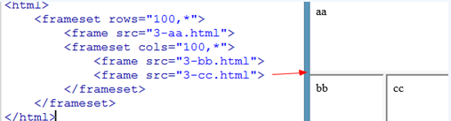

## 常见的标记

### 1.标题

一级标题：`<h1></h1>`
二级标题：`<h2></h2>`
...
六级标题：`<h6></h6>`

>标题标签在SEO搜索引擎中权重比较大
>
>SEO：（Search Engine Optimization）：汉译为[搜索引擎](https://baike.baidu.com/item/%E6%90%9C%E7%B4%A2%E5%BC%95%E6%93%8E)优化
>

### 2.排版标记

段落标记：`<p></p>`
水平线：`<hr>`
换行：`<br>`

### 3.字体标记

粗体：`<b></b>`
斜体：`<i></i>`
下划线：`<u></u>`

### 4.强调标记

粗体：`<strong></strong>`
斜体：`<em></em>`
下划线：`<ins></ins>`

> 强调标记SEO中权重更大

## 标签的属性

### 1.标签的分类

双标签：成对出现的标签，内容写在标签中间`<p>段落</p>`

单标签：单个的标签，没有内容只有属性`<hr>`

### 2.属性

每个标签都有属性，一个标签可以有多个属性

`<标签名 属性1="值1" 属性="值2"></标签名>`

## 列表

1.无序列表 

```html
<ul>
   <li type='circle'>空心圆</li>
   <li type='square'>正方形</li>
   <li type='disc'>实心圆-默认</li> 
</ul>
```

2.有序列表

```html
<ol>
    <li type='A'>大小写英文字母(A,a)</li>
    <li type='i'>大小写罗马数字(I,i)</li>
    <li type='1'>阿拉伯数字-默认</li>
</ol>
```

自定义列表

```html
<dl>
    <dt>标题</dt>
	<dd>标题的补充</dd>
</dl>
```

## 超链接

`<a></a>`

target

- _blank：跳转到新页面
- _self：原页面上打开

title：鼠标悬浮显示的值

1.内部链接：本地跳转 `href='index.html'`

2.外部链接：跳转到其他网站 `href='www.baidu.com'`

3.下载链接：跳转到浏览器无法打开的文件 `href='my.ppt'`

4.锚点链接：跳转到指定锚点处 `href='#ss'` `<p id='ss'></p`

## 路径

1.相对路径

当前目录： `./ ` 可省略
上级目录：`../`

2.绝对路径

以盘符开头 `C:\index.html`

## 图片标签

``

## 预排版标签

```html
<pre>
    									上
    左																右
    									下
    </pre>
```

## <!DOCTYPE>标签

声名文档类型html，告知浏览器以html的规范解析当前文档，html和过渡性较常用

```html
<-- html5的doctype声明 -->
<!DOCTYPE html>
<-- XHTML 1.0 的严格型doctype声明：Strict -->
<!DOCTYPE html PUBLIC "-//W3C//DTD XHTML 1.0 Strict//EN" 
"http://www.w3.org/TR/xhtml1/DTD/xhtml1-strict.dtd">
<--XHTML 1.0 的过渡型doctype声明：Transitional-->
<!DOCTYPE html PUBLIC "-//W3C//DTD XHTML 1.0 Transitional//EN" "
http://www.w3.org/TR/xhtml1/DTD/xhtml1-transitional.dtd">   
```

## 实体


## 表格

表格：`<table></table>`

行：`<tr></tr>`

单元格：`<td></td>`

列标题：`<th></th>`

表格标题：`<caption></caption>`

边框：`<table border = 1>`

对齐方式`<td>`

- 水平对齐：`align="center/left/right"`
- 垂直对齐：`valign="top/middle/bottom"`

单元格间距和填充`<table>`

- 格间距（cellspacing）：单元格和单元格距离，默认是2像素

- 单元格填充（cellpadding）：单元格和内容的距离，默认是1像素

合并单元格

- 合并行(rowspan)：把不同的行合并起来，写在上面的单元格上面

- 合并列(colspan)：把不同列合并起来，写在左边的单元格上面

>取值是数值，需要合并几个单元格就写数字几就行，一旦合并了单元格，删除多余的单元格

## 排版标签

div标签：存放一切内容

span标签：一般只用于存放文字

## 标签通用属性

id：id属性是标签的唯一标识，每个标签的id属性的值必须是唯一的

class：通常用来使用class属性值给标签设置样式，样式一样的标签可以设置同样的class

name：标签名字

style：标签样式

## 表单

表单域标签：`<form></form>`，放置所有的表单元素，faction属性的值就是数据提交的地址，服务器接收数据靠的就是表单的name属性

注意：form是一个双标签，里面包含所有需要一次

- 文本框 ：`type='text' maxlength = 6`

- 密码框：`type='password'`

- 单选框：`type='radio'`  
  - 实现单选必须加name属性，且name值必须相同
  - 无法输入的表单必须给value赋值
  - 默认选中 `checked = 'checked'`
  
- 复选框：`type=’checked‘` 参考单选框，可多选

- 文件上传：`type=’file'`

- 下拉菜单：默认选中`selected='selected'`，分组用`optgroup`

  ```html
  <select>
  	<option>江苏</option>
      <option>浙江</option>
      <option>安徽</option>
      <optgroup label="省份">
  			<option value="1">山东省</option>
  			<option value="2">河北省</option>
  			<option value="3" selected>河南省</option>
  	</optgroup>
  </select>
  ```
  
- 文本域：`<textarea></textarea>`

  - cols 宽度
  - rows 高度

- 按钮

  - 普通：`type ='button'`
  - 提交：`type='sumbit'`
  - 重置：`type='reset'`
  

## 框架

### 1.框架标签

`<frameset>`：框架集，rows属性设置框架分几行显示，cols属性用来设置框架分几列显示，rows和cols尽量不要同时设置（因为不能及时辨别每个位置的页面）

`<frame>`：框架，src属性用来引入要显示的页面

> 框架页面不能有body标签
>
> 可以将body标签放到`<noframes></noframes>`标签中
>
> noframes标签是当浏览器不支持框架时显示


### 2.框架嵌套



### 3.框架中跳转


### 4.内嵌框架

页面内嵌套框架

<iframe src="http://www.baidu.com" width="500" height="200" marginwidth="0" marginheight="0" frameborder="0"></iframe>

- src：内嵌框架中存放的页面
- width和height：内嵌框架的宽度和高度
- marginwidth：内嵌框架中的页面距离内嵌框架的宽度
- marginheight：内嵌框架中的页面距离内嵌框架的高度
- frameborder：内嵌框架边框

## html5-新特性

### 1.语法更简单

a) 头部声明

`<!doctype html>`

b) 简化了字符集声明

`<meta charset="utf-8">`

### 2.语法更宽松

a) 可以省略结束符的标签

li、dt、dd、p、optgroup、option、tr、td、th

b) 可以完全省略的标签

html、head、body

### 3.标签语义化

增加了很多标签，在作页面的时候更加具有语义（定义了一些原本没有语义的div模块为有鲜明结构的语义模块）

a) `<header> `标记定义一个页面或一个区域的头部

b) `<nav>`标记定义导航链接

c) `<article>`标记定义一篇文章内容

d) `<section>`标记定义网页中一块区域

e) `<aside>`标记定义页面内容部分的侧边栏

f) `<footer>`标记定义一个页面或一个区域的底部

| 语义化标签图示                                 |
| ---------------------------------------------- |
|  |

### 4.表单新增常用属性


- required：必填

- placeholder：输入内容提示

- autofocus：自动获取焦点-----自动帮我们将光标点进去

### 5.input新增type

[input其他属性](#表单)

- email：`type = 'email'`

- 日期：`type='date'`

- 时间：`type='time'`
- 月份：`type='month'`

- 周：`type='week'`
- 数字：`type='number'`
- 滑块：`type='range'`

- 颜色：`type='color'`

## 多媒体标签

### 1.embed标签

h4,h5，播放音频和视屏

```html
<embed src='文件' autostart='自动播放' loop='循环播放' hidden='控制面板是否隐藏'></embed>
```

参考：https://www.cnblogs.com/lgx5/p/5714494.html

### 2.audio标签

h5，播放音频

```html
<audio src='文件' controls='controls' autoplay='autoplay' loop='loop'></audio>
```

参考：https://www.cnblogs.com/linn/p/3408515.html

### 3.video标签

h5，播放视屏

```html
<video controls autoplay loop>
    <source src="文件1">
    <source src="文件2">
</video>
```

参考：https://blog.csdn.net/keji_123/article/details/77717849

## 字符集和字符编码

**字符集**

ansi：不同的国家和地区制定了不同的标准，由此产生了 GB2312、GBK、Big5、Shift_JIS 等各自的编码标准。这些使用 1 至 4 个字节来代表一个字符的各种汉字延伸编码方式，称为 ANSI 编码。在简体中文Windows操作系统中，ANSI 编码代表 GBK 编码；在日文Windows操作系统中，ANSI 编码代表 Shift_JIS 编码。 不同 ANSI 编码之间互不兼容，当信息在国际间交流时，无法将属于两种语言的文字，存储在同一段 ANSI 编码的文本中。

unicode：Unicode（[统一码](https://baike.baidu.com/item/%E7%BB%9F%E4%B8%80%E7%A0%81)、万国码、单一码）是计算机科学领域里的一项业界标准，包括字符集、编码方案等。Unicode 是为了解决传统的字符编码方案的局限而产生的，它为每种语言中的每个字符设定了统一并且唯一的[二进制](https://baike.baidu.com/item/%E4%BA%8C%E8%BF%9B%E5%88%B6)编码，以满足跨语言、跨平台进行文本转换、处理的要求。

**字符编码**

UTF-8（8-bit Unicode Transformation Format）是一种针对Unicode的可变长度字符编码，又称万国码，用在网页上可以统一页面显示中文简体繁体及其它语言（如英文，日文，韩文）。

GB2312是一个简体中文字符集，由6763个常用汉字和682个全角的非汉字字符组成。其中汉字根据使用的频率分为两级。一级汉字3755个，二级汉字3008个。

GBK即汉字内码扩展规范，K为扩展的汉语拼音中“扩”字的声母。英文全称Chinese Internal Code Specification。GBK编码标准兼容GB2312，共收录汉字21003个、符号883个，并提供1894个造字码位，简、繁体字融于一库。

Big5 **又称为**大五码**或**五大码**，是使用[繁体中文](https://baike.baidu.com/item/%E7%B9%81%E4%BD%93%E4%B8%AD%E6%96%87)（正体中文）社区中最常用的电脑[汉字](https://baike.baidu.com/item/%E6%B1%89%E5%AD%97)[字符集](https://baike.baidu.com/item/%E5%AD%97%E7%AC%A6%E9%9B%86)标准，共收录13,060个汉字。虽普及于[台湾](https://baike.baidu.com/item/%E5%8F%B0%E6%B9%BE)、[香港](https://baike.baidu.com/item/%E9%A6%99%E6%B8%AF)与[澳门](https://baike.baidu.com/item/%E6%BE%B3%E9%97%A8)等繁体中文通行区