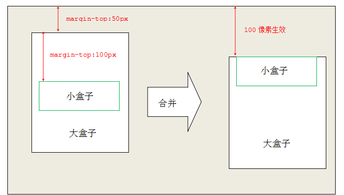
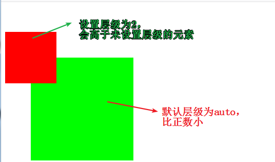
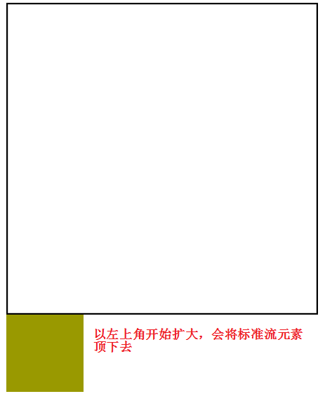

# CSS

Cascading  Style  Sheets （层叠样式表）

## css字体和文本

语法

- `<style></style>`
- 大括号
- 语法：属性：值（键值对）

### 字体属性

- **字体大小**：数字 + 像素单位(px)  `font-size:50px`
  
- 取值用偶数，默认16px，字体大小 
  
- **字体粗细**：normal 正常的（400）、bold加粗（700）、bolder(900)`font-weight`

- **字体风格**：norma（默认） italic（字体倾斜）`font-style `

- **字体**：宋体，微软雅黑，黑体`font-family`

  - 字体可以写多组，中间逗号隔开
  - 有空格 # $ 特殊字符 中文，需要添加引号

- font简写：`font: font-style  font-weight  font-size/line-height  font-family`

  >font-size和font-family必须指定，其余选写
  >
  >eg：`font:italic bolder 30px/100px "微软雅黑";`

### 文本属性

**文本修饰**：`text-decoration:值`

- underline 下划线
- overline 上划线
- line-through 删除线
- none 无

**文本转换**：`text-transform:值`

- uppercase：转大写
- lowercase：转小写
- capitalize：首字母大写

**文本对齐方式**：`text-align:值`

- left：左对齐 - 默认
- center：居中对齐
- right：右对齐

**首行缩进**：`text-indent:值`

- 值可以是px或em

### 字体颜色

`color:"颜色值"`

## css基本选择器

**标签选择器**：标签{css} `p{}`

**id选择器**：#id名{css} `#id{}`

**class选择器**：.类名{css} `.class{}`

**复合选择器**：

- 标签和类选择器`p.class{}` - 类名为class的p标签 
- 多个类选择同一元素：`.class1.class2{}`
- 多个元素同一样式：元素1，元素2{css样式} `div,p{}`

## css常用选择器

**通配选择器** ：给所有标签添加样式`*{css样式}`

> `*{padding:0;margin:0;}`

**后代选择器**：选择元素里面的元素 `外层 内层{css样式}`

**子元素选择器**：选择元素的直接子元素 `父元素>子元素{css样式}`

**相邻元素选择器**：选择相邻的元素 `元素1 + 元素2{css样式}`

> 通过元素1选到元素2

**伪类**：

- 元素:link        正常连接时候的状态
- 元素:visited   点击以后的状态
- 元素:hover     鼠标移动上去的状态
- 元素:active     鼠标按下去时候的状态

> visited和link不能适用于普通标签，只有a标签才有

**伪对象选择器**

- 选择第一个字符 `元素:first-letter`
- 选择第一行 `元素:first-line`

**属性选择器**

- **[属性名]** 具有该属性的元素 `input[value]`
- **[属性=值]** 具有该属性且等于该值的元素 `input[name='myqz']`
- **[属性~=值]** 具有该属性，且值中包含该值的元素`input[name~='tom']` `(name='jack tom sam')`
- **[属性|=字符]** 由连字符连接多个单词组成的属性值中的第一个单词 `input[name|=zhang]` `(name='zhang-san')`
  - **[属性*=值]**：选择属性的值中包含当前的值的元素 `input[name='x']` `(name='ssxb')`

## css尺寸和行高

### **尺寸属性**

**宽度**：`width:值`

**高度**：`height:值`

> 单位 px 或 em
>
> div不设高度，默认为0
>
> span设置宽度无效

### **行高**

文字与文字之间的上下距离 `line-height:值`

> 标签的高度和行高设置成一样，标签文字在标签里垂直居中

## 背景属性

### 基本属性

**背景颜色**：`background-color:颜色值`

**背景图片**：`background-image:url(图片路径)`

**背景图片平铺**：`background-repeat:值`

- no-repeat不平铺
- repeat-x横向平铺
- repeat-y纵向平铺
- repeat横向纵向都平铺 - 默认

**背景图片位置**：`background-position:水平位置，垂直位置`

- top left bottom right center

> 只有一个值为center，水平方向和垂直方向都是这个值
>
> 只有一个值为top left bottom right，另一个方向默认为center

**背景图片大小**：`background-size:宽度 高度`

**background简写**：`background:颜色 url(图片路径) 平铺类型 位置/大小` 

**背景受滚动条的影响**：`background-attachment:值`

- scroll会受滚动条的影响，当内容滚动到下方，图片会消失 - 默认
- fixed不会受滚动条影响，一直保持在视线范围内

**背景透明**：`background:rgba()` ，取值 0-1 

>img 和 backgroud-image区别
>
>img不需要专门写宽高就能够显示在页面上
>
>backgroud-image撑不开容器的 需要专门写宽高

### **背景渐变**

#### 	①线性渐变

语法：

```css
<linear-gradient>：linear-gradient([ <point>,]? <color-stop>[, <color-stop>]+);
<point>：[ left | right ]? [ top | bottom ]? || <angle>?
<color-stop>：<color> [ <length> | <percentage> ]?
```

取值：

```shell
<point>
    left： 设置左边为渐变起点的横坐标值。 
    right： 设置右边为渐变起点的横坐标值。 
    top： 设置顶部为渐变起点的纵坐标值。 
    bottom： 设置底部为渐变起点的纵坐标值。 
	<angle>： 用角度值指定渐变的方向（或角度）,单位deg。 
<color-stop>： 指定渐变的起止颜色。 <color-stop>
    <color>： 指定颜色。请参阅颜色值 
    <length>： 用长度值指定起止色位置。不允许负值 
    <percentage>： 用百分比指定起止色位置。 
```

##### 写法一：

代码：

```html
<div></div>
<style type="text/css">
    div{
        width:300px;
        height:200px;
        background:linear-gradient(red,black); 
        /* 表示颜色从上往下，从红色到绿色转换，各占50%(默认) */
    }
</style>
```


| 效果图                                        |
| --------------------------------------------- |
|  |

##### 写法二：

代码

```html
<div></div>
<style type="text/css">
    div{
        width:300px;
        height:200px;
        background:linear-gradient(to right,red,black); 
        /* 表示颜色的渐变方向(也是九宫格) */
    }
</style>
```


| 效果图                                        |
| --------------------------------------------- |
|  |

##### 写法三：

代码

```html
<div></div>
<style type="text/css">
    div{
        width:300px;
        height:200px;
        background:linear-gradient(45deg,red,black); 
        /* 表示中间的水平线顺时针旋转10度开始渐变 */
    }
</style>
```


| 效果图                                        |
| --------------------------------------------- |
|  |

| 角度示意图                                    |
| --------------------------------------------- |
|  |


##### 写法四：

代码

```html
<style type="text/css">
	div{
		width:300px;
		height:200px;
		background:linear-gradient(red 20%,black 50%,pink); 
		/* 表示颜色渐变所占的百分比 */
	}
</style>
```


| 效果图                                        |
| --------------------------------------------- |
|  |

##### 写法五：

代码

```html
<style type="text/css">
	div{
		width:300px;
		height:200px;
		background:linear-gradient(to top right,red 20%,black 30%,pink); 
		/* 复合写法，表示颜色从左下角往右上角，从红色开始渐变到20%，再由黑色从20%渐变到30%，剩下的都是粉色 */
	}
</style>
```

 

| 效果图                                        |
| --------------------------------------------- |
|  |

**颜色渐变方向有**：to bottom、to top、to left、to right、to top right、to top left、to bottom left、to bottom right【其实就是一个四边形的四条边与四个角】

#### ②径向渐变

语法：

```css
<radial-gradient>：radial-gradient([ <position>,]? [ [ <shape> || <size> ] | <shape-size>{2},]? <color-stop>[, <color-stop>]+);
<position>：[ <length>① | <percentage>① | left | center① | right ]? [ <length>② | <percentage>② | top | center② | bottom ]?
<shape>：circle | ellipse
<size>：closest-side | closest-corner | farthest-side | farthest-corner | contain | cover
<shape-size>：<length> | <percentage> 
<color-stop>：<color> [ <length> | <percentage> ]?
```

取值：

```shell
<position>
	<percentage>①： 用百分比指定径向渐变圆心的横坐标值。可以为负值。 
	<length>①： 用长度值指定径向渐变圆心的横坐标值。可以为负值。 
    left： 设置左边为径向渐变圆心的横坐标值。 
    center①： 设置中间为径向渐变圆心的横坐标值。 
    right： 设置右边为径向渐变圆心的横坐标值。 
    <percentage>②： 用百分比指定径向渐变圆心的纵坐标值。可以为负值。 
    <length>②： 用长度值指定径向渐变圆心的纵坐标值。可以为负值。 
    top： 设置顶部为径向渐变圆心的纵坐标值。 
    center②： 设置中间为径向渐变圆心的纵坐标值。 
    bottom： 设置底部为径向渐变圆心的纵坐标值。 
<color-stop>： 指定渐变的起止颜色。 
<shape>
    circle： 指定圆形的径向渐变 
    ellipse： 指定椭圆形的径向渐变。写本文档时Chrome,Safari尚不支持该参数值 <size>
    closest-side： 指定径向渐变的半径长度为从圆心到离圆心最近的边 
    closest-corner： 指定径向渐变的半径长度为从圆心到离圆心最近的角 
    farthest-side： 指定径向渐变的半径长度为从圆心到离圆心最远的边 
    farthest-corner： 指定径向渐变的半径长度为从圆心到离圆心最远的角 
    contain： 包含，指定径向渐变的半径长度为从圆心到离圆心最近的点。类同于closest-side 
    cover： 覆盖，指定径向渐变的半径长度为从圆心到离圆心最远的点。类同于farthest-corner <shape-size>
    写本文档时Firefox尚不支持<shape-size> <percentage>： 用百分比指定径向渐变的横向或纵向直径长度，并根据横向和纵向的直径来确定是圆或椭圆。不允许负值。 
    <length>： 用长度值指定径向渐变的横向或纵向直径长度，并根据横向和纵向的直径来确定是圆或椭圆。不允许负值。 <color-stop>
    <color>： 指定颜色。请参阅颜色值 
    <length>： 用长度值指定起止色位置。不允许负值 
    <percentage>： 用百分比指定起止色位置。
```

##### 写法一：

代码

```html
<div></div>
<style type="text/css">
	div{
		width:300px;
		height:200px;
		background:radial-gradient(orange,black);
		/* 从中心点向四周扩散渐变 */
	}
</style>
```


| 效果图                                        |
| --------------------------------------------- |
|  |

多学一招：div如果是正方形，扩散的形状会是圆形

```html
<div></div>
<style type="text/css">
	div{
		width:200px;
		height:200px;
		background:radial-gradient(orange,black);
	}
</style>
```


| 效果图                                        |
| --------------------------------------------- |
|  |

##### 写法二：

代码

```html
<div></div>
<style type="text/css">
	div{
		width:200px;
		height:200px;
		background:radial-gradient(orange 20%,black 30%,red 70%);
        /* 代表颜色扩散到哪个位置停止渐变 */
	}
</style>
```


| 效果图                                        |
| --------------------------------------------- |
|  |

多学一招：除了使用百分比还可以使用具体像素设置停止渐变的位置

```html
<div></div>
<style type="text/css">
	div{
		width:200px;
		height:200px;
		background:radial-gradient(orange 50px,black 30%,red 70%);
		/* 橘色区域半径50px */
	}
</style>

```


| 效果图                                        |
| --------------------------------------------- |
|  |

因为50像素已经超过30%，所以橘色部分没有渐变（试试橘色和黑色都是30%）

##### 写法三：

代码：

```html
<div></div>
<style type="text/css">
	div{
		width:300px;
		height:200px;
		background:radial-gradient(circle,orange 10%,black 50%);
		/* 指定渐变的形状 */
	}
</style>
```


| 效果图                                        |
| --------------------------------------------- |
|  |

注意：指定形状的时候可以是circle圆形，也可以是ellipse椭圆

##### 写法四：

代码：

```html
<div></div>
<style type="text/css">
	div{
		width:300px;
		height:200px;
		background:radial-gradient(circle 100px,orange 10%,black 50%);
		/* 指定渐变的区域大小，因为是圆形，所以代表宽100px高也是100px */
	}
</style>
```


| 效果图                                        |
| --------------------------------------------- |
|  |

注意：如果指定的**<font color="red">形状</font>**是**圆形**，那么指定区域大小的时候只需要一个值就好，可要是**椭圆形**的时候需要两个值，因为椭圆的宽和高不一样，否则直接不能显示页面

```html
<style type="text/css">
	div{
		width:300px;
		height:200px;
		background:radial-gradient(ellipse 200px 100px,orange 10%,black 50%);
		/* 指定椭圆形的区域大小需要两个值一个宽一个高 */
	}
</style>

```


| 效果图                                        |
| --------------------------------------------- |
|  |

##### 写法五：

代码：

```html
<div></div>
<style type="text/css">
	div{
		width:300px;
		height:200px;
		background:radial-gradient(ellipse 200px 100px at right bottom,orange 10%,black 50%);
		/* 指定径向渐变的圆心 */
	}
</style>
```


| 效果图                                        |
| --------------------------------------------- |
|  |

多学一招：圆心默认在中心，或者使用关键字center

#### 	③重复线性渐变

语法：

```css
repeating-linear-gradient(方向,颜色 结束百分比,...);
```

例：

```html
<div></div>
<style type="text/css">
	div{
		width:300px;
		height:200px;
		background:repeating-linear-gradient(to right bottom,red 10%,green 20%);
		/* 渐变方向为右下角，指定每种颜色的结束位置，重复渐变 */
	}
</style>
```


| 效果图                                        |
| --------------------------------------------- |
|  |

#### 	④重复径向渐变

语法：

```css
repeating-radial-gradient(形状 方向,颜色 结束百分比,...;
```

例：

```html
<div></div>
<style type="text/css">
	div{
		width:300px;
		height:200px;
		background:repeating-radial-gradient(ellipse at center,red 10%,green 20%);
		/* 渐变形状为椭圆，渐变中心为中心，指定每种颜色的结束位置，重复渐变 */
	}
</style>
```


| 效果图                                        |
| --------------------------------------------- |
|  |

注意：未指定颜色值的结束位置时，颜色是平均分配的

## **列表属性**

列表前缀样式：`list-style-type:none`

列表前缀自定义图片：`list-style-image:url(图片路径)`

>通常在网页中，使用的列表都是要去除前面的符号，并且去除左边和上边的空间
>
>ul{
>    list-style:none;
>    padding:0;
>    margin:0;
>}

## 内容溢出

`overflow:值`

- auto：内容溢出时，生成滚动条 - 默认

- hidden：内容溢出时超出部分隐藏

- scroll：右边和下边都有滚动条	

> 水平方向溢出可以使用overflow-x，纵向溢出使用overflow-y

##   css样式分类

### 1.内部样式----内联样式

```html
<style type="text/css">
/* 样式 */
</style>
```

### 2.行内样式

```html
<div style="color:red;">
    我是盒子
</div>
```

### 3.外部样式

```html
1.使用标签关联
<link rel="stylesheet" type="text/css" href="css文件路径">
2.使用指令关联
<style type="text/css">
/* 在style标签中 */
    @import url("css文件路径")
</style>
```

> 行内样式权重最高
>
> 行内样式控制一个标签
>
> 内部样式控制一个页面
>
> 外部样式控制整个站点

## 样式的继承和覆盖

父标签设置了样式，子标签都会具有父标签的样式

- font系列，text系列，color，line-height 能继承
- div不能继承高度，可以继承宽度
- 子标签和父标签设置相同css，会覆盖父标签样式

## 样式优先级

​	**样式分类**：行内样式>内部/外部，内部样式和外部样式没有权重之分，关键是看他们的加载顺序

​	**样式优先级**：`伪类首字>伪类首行>!important>id名>类名/属性>标签名>通配`

​	**样式叠加**：`!important(无穷大)   行内样式(1000)  id(100)   class(10)   标签(1)`

	> 继承来的样式不计算权重，也就是说**关键看是不是直接修饰的目标标签**
	>
	> 每一级满10也不会往前进1  eg:10个标签的权重小于一个class

## 标签显示模式

### 1.块元素

宽度默认是100%，高度默认是0，可以设置宽度和高度，会继承父级的宽度，换行显示

`div  ul  li  p  h1`

### 2.行元素

宽高默认都是0，不能设置宽和高，一行显示

`span  b  i  u  a`

### 3.行内块元素

只能设置宽和高，不能换行显示

`img input`

### 4.模式转换

`display:值`

- block转成块元素
- inline转成行元素
- inline-block转成行内的块元素
- none隐藏元素 （隐藏后不占空间）

## 盒子模型

### 1.内边距padding

添加了padding元素，**会增加盒子宽或高，需要手动减去**

### 2.外边距margin

`margin:0 auto;` 

让盒子在其父元素居中 

|            | margin:0 auto；                                | text-align:center;                             |
| ---------- | ---------------------------------------------- | ---------------------------------------------- |
| 针对的对象 | 块元素                                         | 行元素和行内块                                 |
| 居中的范围 | 作用与自身，在父元素中居中（不能对行元素生效） | 设置在父元素，作用于子元素（不能对块元素生效） |

### 3.边框属性

**同padding，加边框后，盒子会变大**

**边框类型**：`border-style:值`

- solid实线
- dashed虚线
- dotted点线
- double双线

**边框颜色**：`border-color:颜色值`

**边框厚度**：`border-width:尺寸值`

**简写**：`border:宽度 类型 颜色` 

**边框圆角**：`border-radius:值` -> (像素或百分比)

**分别设置**：border-top、border-left、border-bottom、border-right

**去边框**：border：none

> 块级盒子没有width（包含继承）,添加padding和border不会撑大盒子

[border-image](补充\border-image)

[border-radius](补充\border-radius)

### 4.盒子模型的bug

**1.盒子上下摆放，上盒子有下外边距，下盒子有上外边距，两个边距会重合，以大的边距为准**


**解决**：避免或将这个间距都给到一个元素上面


**2.两个盒子嵌套关系，两个盒子对于上外边距会重合，以大的边距为准**



**解决**：

- 给外部盒子加上边框或者上padding-top

- 给外部盒子添加oveflow:hidden

## 元素可见性

`visibility:值` （**占空间**）

- hidden隐藏
- visible可见

`display:none`（**不占空间**）

## 伪对象

给元素追加一个虚拟标签，由css加载，可以节省html的资源开销，必须有content属性，默认是行元素，可以进行转换

- `::after` 指定标签后添加一个对象
- `::before`指定标签前添加一个对象
- `content`元素里面的内容 

```css
元素::after{
    content:"";
}
```

<font color="red">注意：伪对象样式中，必须有content属性，否则伪对象无效</font>

> 伪对象不是实际标签，使用css样式模拟一个标签
>
> 伪元素是行元素

## 布局

- **标准流**：按照标签默认的特性摆放盒子

- **浮动流**：利用浮动摆放盒子

- **定位流**：利用定位摆放盒子

### 1.浮动

`float:left/right/none`

块元素同行显示 -> 给一行的所有块元素都加上浮动

> 浮动的元素脱离标准流

#### **行元素浮动**

会优先于普通元素占据设置方向的位置，不会重叠


#### **块元素浮动**

会脱离页面原本的文本流（不占据原本的空间），会覆盖其他元素


- 设置浮动的元素，居中不起作用

- 浮动元素不会覆盖文字

- 大盒子放不下了，浮动元素会掉下去，掉下去的元素位置根据上一个元素的高度：

  - 上一个元素高度比较大，高度的起始位置，在上一个元素的下方
  - 上一个元素高度比较小，在上一个元素的正下方

  

  > 脱离文本流的元素具有行内块元素特性：**不换行，能设置宽高** （行内块）

#### 浮动引起的问题

浮动的盒子撑不开父容器

-  给父元素设置高度 (不推荐，高度一般可变)

- 父元素后设定空标签进行清除浮动（`clear:both`）

- 设定父元素的overflow `overflow:auto`

- 使用伪对象代替空标签(**推荐**)

  ```css
    .box:after {
              content: "";
              display: block;
              clear: both;
     }
  ```

  > hidden 溢出全部隐藏
  >
  > auto 溢出产生滚动条

## 阴影

**文本阴影**：`text-shadow:横向偏移 纵向偏移 模糊距离 颜色`

**边框阴影**：`box-shadow: 水平偏移 垂直偏移 模糊距离 阴影尺寸 颜色;`

>边框阴影和边框没有关系

[边框阴影](补充\阴影)

## 细线表格

`border-collapse:collapse;`

```css
table{
    border-collapse:collapse
}
```

> 表格和单元格都加边框属性

## 定位

### 1.静态定位

所有标准流都是静态定位

`position:static`

```css
		.box{
			width:100px;
			height:100px;
			border:1px solid #000;
			position:static;/* 设置静态定位 */
			top:20px;/* 设置边偏移 */
		}
		.box1{
			width:200px;
			height:200px;
			background:#f00;
		}
```


>通常是将已经设置过定位的元素还原成标准流

### 2.相对定位

相对于自身在标准流的位置进行定位移动	

`position：relative`

```css
		.box{
			width:100px;
			height:100px;
			border:1px solid #000;
			position:relative;/* 设置相对定位 */
			top:20px;/* 设置边偏移 */
			left:30px;
		}
		.box1{
			width:200px;
			height:200px;
			background:#f00;
		}
```


- 移动的出发点是自身标准流的位置
- 移动之后，自身在标准流中还占有空间，真正占得位置还是标准流的位置
- 可以盖在标准流的上方


### 3.绝对定位

从父元素一直往上找设置过定位的直系父元素，作为自己的偏移参照物

`position:absolute`

```css
		.box{
			width:100px;
			height:100px;
			border:1px solid #000;
			position:absolute;/* 设置绝对定位 */
			top:20px;/* 设置边偏移 */
			left:30px;
		}
		.box1{
			width:200px;
			height:200px;
			background:#f00;
		}
```


- 偏移位置参考设置过定位（相对/绝对/固定）的**直系**父元素或**直系**祖宗元素，没找到就一直往上级找，直到html
- 会脱离标准流，不再继承父级的宽度,大小取决于内容，可以定义宽高，不占据标准流的空间
- margin:auto对于设置过绝对定位的元素不起作用
- 设置方向偏移的时候，横向或者纵向只设置一个即可，设置多个没有意义

**水平垂直居中**

```css
	.box{
			width:100px;
			height:100px;
			border:1px solid #000;
			position:absolute;/* 设置绝对定位 */
			top:50%;/* 设置上边偏移 */
			margin-left:-50px;/* 往左边移动自身宽度的一般 */
			left:50%;/* 设置做边偏移 */
			margin-top:-50px;/* 往上面移动自身高度的一半 */
		}
```

### 4.固定定位

以浏览器作为参考进行偏移，且滚动条对固定定位无效

`position:fixed`

```cs
	.box{
			width:300px;
			height:200px;
			background:#abcdef;
			position:fixed;/* 设置固定定位，相对于浏览器窗口 */
			left:50%;
			top:50%;
			margin-left:-150px;
			margin-top:-100px;
		}

```

- 会脱离文档流，不占据标准流的空间
- 不继承父元素的宽高，需要给自身定义宽高
- margin:auto对固定定位的元素不起作用
- 不会随着滚动条滚动，永远固定在浏览器窗口中的位置（移动的出发点：浏览器窗口，滚动条对设置了固定定位的元素无效）

### 总结

| 定位模式         | 是否脱标占有位置     | 是否可以使用边偏移 | 移动位置基准             |
| ---------------- | -------------------- | ------------------ | ------------------------ |
| 静态static       | 不脱标，正常模式     | 不可以             | 正常模式                 |
| 相对定位relative | 不脱标，占有位置     | 可以               | 相对自身位置移动         |
| 绝对定位absolute | 完全脱标，不占有位置 | 可以               | 相对于定位的父级移动位置 |
| 固定定位fixed    | 完全脱标，不占有位置 | 可以               | 相对于浏览器移动位置     |

### 5.定位元素层叠效果

控制“定位”元素的叠放层级

`z-index:值`

- 数字
  - 正数，数字越大，层级越高，离用户越近 **>auto**
  - 负数，数字越小，层级越低，离用户越远 **<auto**
- auto：与父元素同级（**默认**）

```css
		/* 两个盒子都设置相对定位并偏移，中间有重叠的部分，默认后设置的会覆盖先设置的 */
		.box{
			width:100px;
			height:100px;
			background:#f00;
			position:relative;
			top:50px;
			z-index:2;/* 设置层叠高一点，会覆盖后设置的 */
		}
		.box1{
			width:200px;
			height:200px;
			background:#0f0;
			position:relative;
			left:50px;
		}
```



- z-index只针对定位元素有效果（但不包括静态定位）
- z-index值越大，层级越高

- 父元素比较过层级了（父元素都有z-index值，且不为auto），子元素之间是不会再去比较的

## css3

### 1.内减模式

将padding内边距和边框带来增大盒子的影响去掉，**不能去margin影响**

`box-sizing:border-box;`

### 2.新增属性选择器

`元素[属性^=值]`：以指定字符开头的属性值的元素

`元素[属性$=值]`：以指定字符结尾的属性值的元素

### 3.新增伪类选择器

| 伪类选择器          | 作用                                   |
| ------------------- | -------------------------------------- |
| :root               | 可以理解为根                           |
| **li:first-child**  | **代表找出父元素中第一个li子元素**     |
| **li:last-child**   | **代表找出父元素中最后一个li子元素**   |
| **li:nth-child(n)** | **找出父元素中的第n个li子元素**        |
| li:nth-child(even)  | 代表找出父元素中奇数的li子元素         |
| li:nth-child(odd)   | 代表找出父元素中偶数的li子元素         |
| li:empty            | 代表找出父元素中li子元素内容为空的标签 |
| li:nth-of-type(n)   | 找出li标签中第几个                     |
| li:first-of-type    | 找出li标签中第一个                     |
| li:last-of-type     | 找出li标签中最后一个                   |
| li:only-child       | 唯一子元素                             |

### 4.2d变换效果

`transform:值`

**移动**：`transform:translate(值1,值2);`

- 值1：横向移动的像素
- 值2：纵向移动的像素

>使用translateX和translateY设置x轴或者y轴，里面只设置一个值即可

**旋转**：`transform:rotate(角度);transform-origin:横向坐标 纵向坐标;`

- 角度：数字deg
- 横纵向坐标确定旋转的圆心（默认中心）【px或者(left,right,top,bottom,center)】

**缩放**：`transform:scale(值)`

- 倍数（整数，小数），两个值（宽度，高度）

**过度效果**：`transition:动画css属性 过渡时间秒数 速度类型 延迟的秒数` 

```css
	img{
		display:block;
		margin:50px auto;
		border:1px solid #000;
		/* 加过渡效果，必须是在元素原本的样式上面加，不在伪类上加 */
		transition:transform 2s linear;
	}
	img:hover{
		transform:scale(1.5);	
	}
```

[2d](补充\2d)

[3d](补充\3d)

[过渡](补充\过渡)

## css属性补充

**光标形状**：`cursor:值`

- text：文本
- f'f'v'b'g'f'vhelp：问号
- wait：等待
- pointer：小手
- move：移动
- default：箭头
- url()：临时替换的样式（加auto） `cursor:url('*.ico'),auto;`

**强调边框**：`outline:值`

- 取值：同边框
- 设置元素边框（常用去去掉输入框蓝色边框 `outline:none`）

**透明度**：`opacity:值` （ 0 - 1）

**背景透明**：`rgba(值1，值2，值3，值4)`

- 值123：颜色（0-255）
- 值4：透明度

**去掉文本域自动拉伸**：`resize:none;`

**行内文字溢出省略号显示**：

```css
		overflow:hidden;
		white-space: nowrap;/* 设置文本不换行，单行显示 */
		text-overflow:ellipsis;/* 超出的文本使用省略号代替 */
```

**行内块与文字对齐方式**（写在行内块内）

- baseline：图片基线和文字基线对齐
- top：图片顶线和文字顶线（行高顶线）对齐
- bottom：图片底线和文字底线（行高底线）对齐
- middle：图片中线和文字中线对齐

**缩放ZOOM**：`zoom:值`

- 倍数（整数，小数）

**zoom和transform区别**

`zoom：2`




`transform:scale(2);`


## 弹性布局

### 1.多栏布局

**分栏显示**：`column-count:值` 

- 值：栏目的数量

**多栏隔断框**：`column-rule:值` 

- 取值同边框

**每一栏的宽度**：`column-width:值`

### 2.弹性布局

实现类似浮动的效果，但是不会脱离文档流

`display:flex`

**方向**：`	flex-direction:值`

- **row** 横向排列（左浮动效果）
- **row-reverse** 横向反向排列（右浮动效果）
- **column** 纵向排列
- **column-reverse** 纵向反向排列，从下到上的排列

**是否换行**：`flex-wrap:值`

- **nowarp** 不换行（**默认**）
- **warp** 换行
- **wrap-reverse** 换行，反向排列，（从下到上，从左到右）

**水平对齐方式**：`justify-content:值`

- **flex-start**：左对齐，从左向右（**默认**）
- **flex-end**：右对齐，从右往左排列
- **space-between**：两端对齐，中间等距离隔开
- **space-around**：环绕对齐，两端的空白是中间空白的一半
- **center**： 居中对齐
- **space-evenly**：等距离排列

**垂直对齐方式**：`align-content:值` （**在换行的时候用**）

- **stretch**：靠上排列，元素之间有间距（**默认**）
- **flex-start**：上对齐，靠上排列
- **flex-end**：下对齐，靠下排列
- **space-between**：两端对齐，中间等距离隔开
- **space-around**：环绕对齐，两端的空白是中间空白的一半
- **center**： 居中对齐
- **space-evenly**：等距离排列

**交叉对齐方式**：`align-items:值`（**需要横向排列**）

- **flex-start**：从起始位置对齐
- **flex-end**：在结束位置对齐
- **center**：居中对齐
- **baseline**：在基准线对齐
- **stretch**：拉伸子元素（图片不行）

**子元素单独在y轴上对齐**：`align-self:值`

- **auto**：继承父容器align-items属性，没有父容器则为"stretch"（**默认**）
- **stretch**：拉伸
- **center**：居中
- **flex-start**：最上面
- **flex-end**：最下面
- **baseline**：容器的基线

>属性结果和align-items一样
>
>**align-items**修饰弹性容器所有子元素
>
>**align-self**修饰当前元素

 [弹性布局.pptx](补充\弹性布局.pptx) 

## css精灵技术

网页加载每一张图片都需要对服务器进行一次请求，所以对服务器的负荷会很大，可以将多个小图放到一张大图上，每个地方使用小图片都对大图进行背景定位即可，这样只需要加载一张大图片，对服务器只做一次请求，可以减少服务器的开销，提供网站的性能

