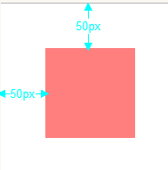
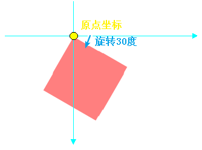
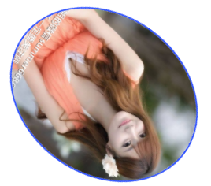
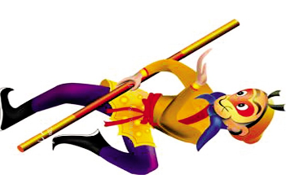
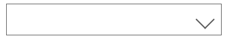
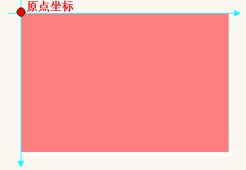
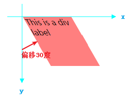
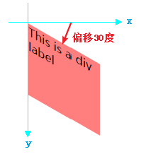
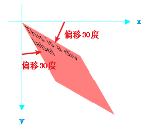
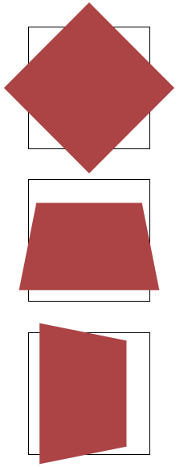

# 2D转换

## 2D转换语法

> 转换是 CSS3 中具有颠覆性的特征之一，通过转换我们可以实现对元素的移动、缩放、转动、拉长或拉伸。


## 转换属性

| 属性             | 描述                       |
| ---------------- | -------------------------- |
| transform        | 向元素应用 2D 或 3D 转换。 |
| transform-origin | 允许你改变被转换元素的位置 |

------

### 2D Transform方法

| 函数                   | 描述                                                    |
| ---------------------- | ------------------------------------------------------- |
| matrix(n,n,n,n,n,n)    | 定义`2D`转换，使用六个值的矩形。                        |
| translate(x, y)        | 定义`2D`转换，沿着 X 和 Y 轴移动元素。                  |
| translateX(n)          | 定义`2D`转换，沿着 X 轴移动元素。                       |
| translateY(n)          | 定义`2D`转换，沿着 Y 轴移动元素。                       |
| scale(x,y)             | 定义`2D`缩放转换，改变元素的宽度和高度（x,y是倍数值）。 |
| scaleX(n)              | 定义`2D`缩放转换，改变元素的宽度。                      |
| scaleY(n)              | 定义`2D`缩放转换，改变元素的高度。                      |
| rotate(angle)          | 定义`2D`转换，在参数中规定角度。(角度单位deg)           |
| skew(x-angle, y-angle) | 定义`2D`倾斜旋转，沿着 X 和 Y 轴。                      |
| skewX(angle)           | 定义`2D`倾斜转换，沿着 X 轴。                           |
| skewY(angle)           | 定义`2D`倾斜转换，沿着 Y 轴。                           |

------

1，translate

语法：translate: transform(x, y);

从当前位置，向下移动x距离，向右移动y距离，x和y可以是百分比，允许负值

```html
<!DOCTYPE html>
<html>
<head>
  <meta charset="utf-8">
  <meta http-equiv="X-UA-Compatible" content="IE=edge">
  <title>CSS3</title>
  <link rel="stylesheet" href="">
  <style type="text/css">
    *{
      padding: 0;
      margin: 0;
    }
    div{
      width: 100px;
      height: 100px;
      background-color: rgba(255, 0, 0, .5);
      transform: translate(50px, 50px);
    }
  </style>
</head>
<body>
  <div>
  </div>
</body>
</html>
```


| 效果图                                    |
| ----------------------------------------- |
|  |

应用场景：让一个盒子垂直水平居中（配合定位）

### 2，rotate()

给定一个度数，顺时针旋转，负值是逆时针旋转

```html
<!DOCTYPE html>
<html>
<head>
  <meta charset="utf-8">
  <meta http-equiv="X-UA-Compatible" content="IE=edge">
  <title>CSS3</title>
  <link rel="stylesheet" href="">
  <style type="text/css">
    *{
      padding: 0;
      margin: 0;
    }
    div{
      margin: 100px;
      width: 100px;
      height: 100px;
      background-color: rgba(255, 0, 0, .5);
      transform: rotate(30deg);
    }
  </style>
</head>
<body>
  <div>
  </div>
</body>
</html>
```


| 效果图                                    |
| ----------------------------------------- |
|  |

小案例：旋转和过渡配合使用（让美女/孙悟空旋转）

```html
<style type="text/css">
	img{
		width: 320px;
		height: 350px;
		display: block;
		margin: 40px auto;
		border-radius: 50%;
		border: #2e51ff solid 2px;
		transition: all 5s;             /*all来表示所有的属性都变化*/
	}
	img:hover{
		transform: rotate(360deg);
	}
</style>
	

```


| 效果图                                                       |
| ------------------------------------------------------------ |
|  |


小案例：移动和旋转组合使用

```html
<!DOCTYPE html>
<html>
<head>
	<meta charset="utf-8" />
	<title></title>
	<style type="text/css">
		div{
			width: 350px;
			height: 50px;
			border:#5f5f5f solid 1px;
			margin:100px auto;
			position: relative;                /*父级相对，子级绝对，只要就会以子级为原点定位*/
		}
		div:after{
			content:'';            /*content即使没有内容是空的，也是要写的*/
			width: 20px;
			height: 20px;
			display: block;           /*因为是行内元素，只有让它以块（block）的形式显示，宽高才会起作用*/
			border-bottom: #5f5f5f solid 2px;          /*下边框*/
			border-right: #5f5f5f solid 2px;          /*右边框*/
			position: absolute;
			top:50%;              /*距离上面50%*/
			right:15px;                 /*距离右边15像素*/
			transform:translateY(-50%) rotate(45deg);       /*向上移动50%，旋转45度*/
		}
		div:hover{
			border: #9361ff solid 1px;            /*当鼠标移上去的时候，颜色变为#9361ff*/
		}
		/*
		*当鼠标移上去后，三角的颜色也要变化
		*/
		div:hover:after{             /*注意是div:hover:after而不是div:after:hover*/
			border-bottom: #9361ff solid 2px;
			border-right: #9361ff solid 2px;
		}
	</style>
</head>
<body>
	<div></div>
</body>
</html>
```


| 效果图                                    |
| ----------------------------------------- |
|  |

### 3，scale()

指定改元素变大或缩小的倍数

```css
transform:scale(3,2);
```


| 效果图                                    |
| ----------------------------------------- |
|  |

### 4，skew()

包含两个参数值，分别表示x轴和y轴倾斜的角度，允许负值，

X轴

```html
<!DOCTYPE html>
<html>
<head>
  <meta charset="utf-8">
  <meta http-equiv="X-UA-Compatible" content="IE=edge">
  <title>CSS3</title>
  <link rel="stylesheet" href="">
  <style type="text/css">
    *{
      padding: 0;
      margin: 0;
    }
    div{
      margin: 50px;
      width: 100px;
      height: 100px;
      background-color: rgba(255, 0, 0, .5);
      transform: skew(30deg, 0deg);
    }
  </style>
</head>
<body>
  <div>
    This is a div label
  </div>
</body>
</html>
```


| 效果图                                    |
| ----------------------------------------- |
|  |


Y轴

```css
transform: skew(0deg, 30deg);
```


| 效果图                                    |
| ----------------------------------------- |
|  |

X轴和Y轴同时偏移

```css
transform: skew(30deg, 30deg);
```


| 效果图                                    |
| ----------------------------------------- |
|  |

## 转换模块的形变中心点：

　　　　　　默认情况下所有的元素都是以自己的中心点作为参考来旋转的, 我们可以通过形变中心点属性来修改它的参考点。　　

　　　　　　1、写法：transform-origin: left top;第一个参数:水平方向，第二个参数:垂直方向。

　　　　　　　　ps：取值有三种形式　　

　　　　　　　　　　具体像素：transform-origin: 200px 0px;

　　　　　　　　　　百分比：transform-origin: 50% 50%;

　　　　　　　　　　特殊关键字：transform-origin: center center;

 　　　　　　2、示例代码：

```html
<!DOCTYPE html>
<html lang="en">
<head>
    <meta charset="UTF-8">
    <title>2D转换模块的形变中心点</title>
    <style>
        *{
            margin: 0;
            padding: 0;
        }
        ul{
            width: 200px;
            height: 200px;
            border: 1px solid #000;
            margin: 100px auto;
            position: relative;
        }
        ul li{
            list-style: none;
            width: 200px;
            height: 200px;
            position: absolute;
            left: 0;
            top: 0;
            transform-origin: left top;
        }
        ul li:nth-child(1){
            background-color: red;
            transform: rotate(30deg);
        }
        ul li:nth-child(2){
            background-color: green;
            transform: rotate(50deg);
        }
        ul li:nth-child(3){
            background-color: blue;
            transform: rotate(70deg);
        }
    </style>
</head>
<body>
<ul>
    <li></li>
    <li></li>
    <li></li>
</ul>
</body>
</html>
```

## 2d转换模块的旋转轴

　　　　　　rotate旋转属性旋转是默认都是围绕z轴旋转，若需要改变旋转轴可以在rotate后加上旋转轴，即：rotateX();rotateY();rotateZ();

　　　　　　1、当围绕x和y轴旋转时就会改变属性距离我们的距离，也就是透视，什么事透视呢，就是近大远小。

　　　　　　2、你会发现元素围绕x轴或y轴旋转时并没有金达远小的效果，这时你需要添加一个透视属性：perspective: 500px;注意：这个属性需要添加在元素的父容器上；

　　　　

```
<!DOCTYPE html>
<html lang="en">
<head>
    <meta charset="UTF-8">
    <title>旋转轴向</title>
    <style>
        *{
            margin: 0;
            padding: 0;
        }
        ul{
            width: 800px;
            height: 500px;
            margin: 0 auto;
        }
        ul li{
            list-style: none;
            width: 200px;
            height: 200px;
            margin: 0 auto;
            margin-top: 50px;
            border: 1px solid #000;
            transform:perspective(500px);
       }
        ul li div{
            width: 200px;
            height: 200px;
            background-color: #ac4345;
        }
        ul li:nth-child(1) div{
            transform: rotateZ(45deg);
        }
        ul li:nth-child(2) div{
            transform: rotateX(45deg);
        }
        ul li:nth-child(3) div{
            transform: rotateY(45deg);
        }
    </style>
</head>
<body>
<ul>
    <li><div></div></li>
    <li><div></div></li>
    <li><div></div></li>
</ul>
</body>
</html> 
```

 

| 示意图                                    |
| ----------------------------------------- |
|  |

