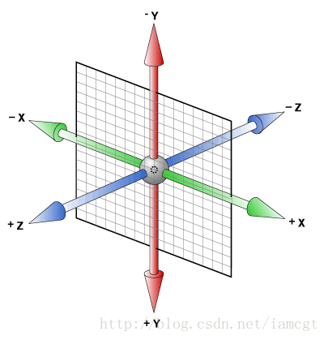
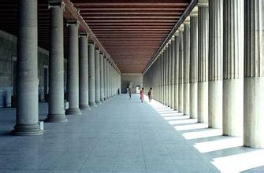
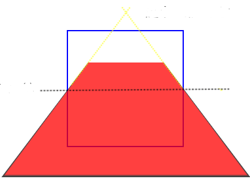
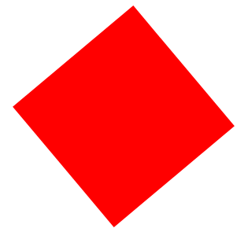
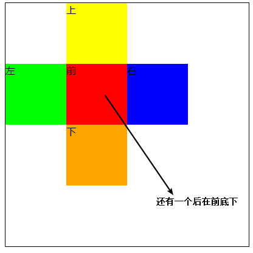
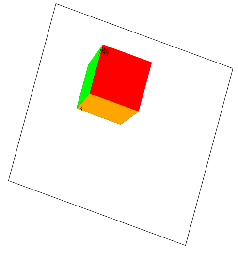

# CSS3--3D转换

## 3d参考

3d变换比2d变换多了z轴，默认的旋转参考线如图

| 示意图                                                |
| ----------------------------------------------------- |
|  |

3d变换比2d变换多的是可以做出立体视觉，但是要看到完整的立体效果（上下左右前后都看到，当然需要经过旋转），需要给父容器添加两个属性：

## 属性介绍

### 1.设置3d效果

让子元素保留3d空间中的效果，否则哪怕做出来的是3d效果图，但是在转动的时候看到的还是平面的2d效果，默认值为flat，是不保留。**该属性设置在父元素上**

```css
transform-style:preserve-3d; /* 保留资子元素的3d空间 */
```

### 2.设置用户与元素3d空间Z平面之间的距离

设置用户与元素3d空间Z平面之间的距离，这个值越小，代表用户离效果图越近，越难以看出整体的效果（不识庐山真面拔毛，只缘身在此山中），这个值越大，代表用户里效果图越远，看的也就更全面（当局者迷，旁观者清），所以我们在面对3d效果的时候，这个值可以说是越大越好，用户看的越全面。**该属性设置在父元素上**。

```css
perspective: number; /* 数字后面要跟像素单位，默认为none */
```

理解：

我们知道当我们在一条通道中看远方的时候，通道两边会随着距离的增加而相交，当然这只是视觉效果，实际是两条平行线，如图

| 示意图                                |
| ------------------------------------- |
|  |

一个矩形进行沿x轴旋转后，我们看到的效果也跟上图类似，最终还是会相交，如下图

| 示意图                                |
| ------------------------------------- |
|  |

### 3.旋转

```css
transform:rotateX(角度);
transform:rotateY(角度);
transform:rotateZ(角度);
transform:rotate3d(x,y,z,角度);
```


**1. rotateX(角度) 方法**

 

rotateX()方法，围绕其在一个给定度数X轴旋转的元素。

```css
div
{
    transform: rotateX(120deg);
    -webkit-transform: rotateX(120deg); /* Safari 与 Chrome */
}
```

**2. rotateY(角度) 方法**

 

rotateY()方法，围绕其在一个给定度数Y轴旋转的元素。

```css
div
{
    transform: rotateY(130deg);
    -webkit-transform: rotateY(130deg); /* Safari 与 Chrome */
}
```

**3.rotateZ(角度)方法**

rotateY()方法，围绕其在一个给定度数Y轴旋转的元素。

单独进行z轴旋转的时候，效果和2d旋转是一样的

```html
<style type="text/css">
		.box{
			width:200px;
			height:200px;
			background:#f00;
			transform:rotateZ(50deg);
            margin:100px;
		}
		
	</style>
	<div class="box">
		
	</div>
```


| 效果图                                    |
| ----------------------------------------- |
|  |

### 4.移动

```css
transform:translateX(距离);
transform:translateY(距离);
transform:translateZ(距离);
transform:translate3d(距离);
```

x轴移动和y轴移动跟2d移动效果一样，z轴移动需要在立体图旋转一定角度才能看得清

### 5.放大缩小

```css
transform:scaleX(倍数);
transform:scaleY(倍数);
transform:scaleZ(倍数);
transform:scale3d(倍数,倍数，倍数);
```

### 6.设置旋转时的参考线

```css
transform-origin:left/right/top/bottom;
```

## 案例

设置一个立方体，鼠标放上去让它旋转并移动

步骤：

​	1.布局：使用定位线布局如下图案

| 示意图                                    |
| ----------------------------------------- |
|  |

​	代码：

```html
<style type="text/css">
	.box{
		width:400px;
		height:400px;
		border:1px solid #000;
		position:relative;
		left:100px;
		top:100px;
		transform-style:preserve-3d;
		perspective:1000px;
		transition:all 5s ease;
	}
	.box div{
		width:100px;
		height:100px;
		position:absolute;
	}
	.pre{
		background:#f00;
		top:100px;
		left:100px;
		z-index:2;
	}
	.after{
		background:#000;
		top:100px;
		left:100px;
		z-index:1;
	}
	.left{
		background:#0f0;
		top:100px;
		left:0;
	}
	.right{
		background:#00f;
		top:100px;
		left:200px;
	}
	.top{
		background:#ff0;
		top:0;
		left:100px;
	}
	.bottom{
		background:DeepPink;
		left:100px;
		top:200px;
	}
</style>
<div class="box">
	<div class="pre">前</div>
	<div class="after">后</div>
	<div class="left">左</div>
	<div class="right">右</div>
	<div class="top">上</div>
	<div class="bottom">下</div>
</div>
```


2.让上（沿下边x轴转动90度）下（沿上边x轴转动-90度）左（沿右边y轴转动90度）右（沿左边y轴转动-90度）进行旋转围起来，让前（沿z轴移动100像素）起来，然后让大盒子转动30度，形成6面体，如下图：

| 示意图                                    |
| ----------------------------------------- |
|  |

代码：

```html
<style type="text/css">
	.box{
		width:400px;
		height:400px;
		border:1px solid #000;
		position:relative;
		left:100px;
		top:100px;
		transform-style:preserve-3d;
		perspective:1000px;
		transition:all 5s ease;
		
		transform:rotate3d(1,1,1,30deg);
	}
	.box div{
		width:100px;
		height:100px;
		position:absolute;
	}
	.pre{
		background:#f00;
		top:100px;
		left:100px;
		z-index:2;
		
		transform:translateZ(100px);
	}
	.after{
		background:#000;
		top:100px;
		left:100px;
		z-index:1;
	}
	.left{
		background:#0f0;
		top:100px;
		left:0;
		
		transform-origin:right;
		transform:rotateY(90deg);
	}
	.right{
		background:#00f;
		top:100px;
		left:200px;
		
		transform-origin:left;
		transform:rotateY(-90deg);
	}
	.top{
		background:#ff0;
		top:0;
		left:100px;
		
		transform-origin:bottom;
		transform:rotateX(-90deg);
	}
	.bottom{
		background:DeepPink;
		left:100px;
		top:200px;
		
		transform-origin:top;
		transform:rotateX(90deg);
	}
</style>
<div class="box">
	<div class="pre">前</div>
	<div class="after">后</div>
	<div class="left">左</div>
	<div class="right">右</div>
	<div class="top">上</div>
	<div class="bottom">下</div>
</div>
```

​	3.设置大盒子透明背景，让效果更明显，鼠标放到大盒子上，进行旋转移动放大

代码：

```html
<style type="text/css">
	.box{
		width:400px;
		height:400px;
		border:1px solid #000;
		position:relative;
		left:100px;
		top:100px;
		transform-style:preserve-3d;
		perspective:1000px;
		transition:all 5s ease;
		
		transform:rotate3d(1,1,1,30deg);
		background:rgba(255,106,106,.5);
	}
	.box div{
		width:100px;
		height:100px;
		position:absolute;
	}
	.pre{
		background:#f00;
		top:100px;
		left:100px;
		z-index:2;
		
		transform:translateZ(100px);
	}
	.after{
		background:#000;
		top:100px;
		left:100px;
		z-index:1;
	}
	.left{
		background:#0f0;
		top:100px;
		left:0;
		
		transform-origin:right;
		transform:rotateY(90deg);
	}
	.right{
		background:#00f;
		top:100px;
		left:200px;
		
		transform-origin:left;
		transform:rotateY(-90deg);
	}
	.top{
		background:#ff0;
		top:0;
		left:100px;
		
		transform-origin:bottom;
		transform:rotateX(-90deg);
	}
	.bottom{
		background:DeepPink;
		left:100px;
		top:200px;
		
		transform-origin:top;
		transform:rotateX(90deg);
	}
	.box:hover{
		transform:translate3d(100px,0,0) rotate3d(2,2,2,180deg) scale3d(2,2,2);
	}
</style>
<div class="box">
	<div class="pre">前</div>
	<div class="after">后</div>
	<div class="left">左</div>
	<div class="right">右</div>
	<div class="top">上</div>
	<div class="bottom">下</div>
</div>
```


