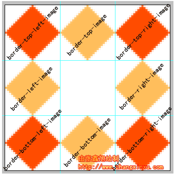

# 图片边框

## border-image的用处

在处理段落的背景图片时，相信大家也遇到过这样的问题，随着段落的大小，要制作不同大小的图片来适应。这样费时又费力，于是九宫格出现了。以前是要做9个容器来分别承载内容和四周背景图，这样未免太过麻烦，border-image很好的解决了这个问题，只需要一个容器和一张图片。

使用图片做边框的场景：

1. 元素边框不规则的情况。这时候，就需要用设计图作为边框背景，border-image与background-image相比，好处是更具灵活性，可以用代码控制边框背景的拉伸和重复，因而能够创造出更多样的效果。
2. 按钮宽高不确定的情况。用border-image来制作按钮，可以用同一张背景图，制造出各种宽高的按钮。

## border-image属性分析

border-image的数值参数其实是用来剪裁边框图片的，正好“哗哗四刀”切出了个九宫格的模型，所以，有意或无意，巧合还是必然，我们需要用到九宫格模型帮助我们理解border-image的绘制原理。如下图：

| 原图                                      |
| ----------------------------------------- |
|  |


| 裁剪的图               |
| ---------------------- |
|  |

这张图能够帮助我们更好的理解border-image的剪裁及绘制的原理。

边框将border-image分成了九部分：border-top-image , border-right-image , border-bottom-image , border-left-image, border-top-left-image , border-top-right-image , border-bottom-left-image , border-bottom-right-image以及中间的内容区域。假设现在边框的宽度是27像素，则上面所说的九部分正如下图

| 示意图                                    |
| ----------------------------------------- |
|  |

左图中，橙红色的四个边角的菱形区域称为“角边框图片”，在border-image中，角边框图片是没有任何展示效果的，不会平铺，不会重复，也不会拉伸，有点类似于视觉中盲点的意思。

加载原图的属性

```css
border-image-source：url(图片源);
```

裁剪图片的属性

```css
border-image-slice：top right bottom left;
```

<font color="red">裁剪图片上下左右的值，不加单位，直接写数字</font>

分别指切割背景图片的四条线距离上右下左的距离。 如下图所示：

| 示意图                                    |
| ----------------------------------------- |
|  |

该距离接受数值，百分数。默认数值的单位是px,但是不能在数值后面加px，否则这句css将不被浏览器解析。
用法和margin，padding类似。这里以数值举例，百分数同理。

```css
border-image-slice: 10;   /*距离上下左右均为10px;*/
border-image-slice: 10 30;   /*距离上下10px,左右30px;*/
border-image-slice: 10 30 20;   /*距离上10px,下20px,左右30px;*/
border-image-slice: 10 30 20 40;   /*距离上10px,右30px,下20px,左40px;*/
```

四条线将背景图分割成了9个部分，其中1,2,3,4,6,7,8,9这八个区域将会被切割，作为图片边框，如果除了设置数值或者百分数，还加了一个“fill”，那么区域5就会作为背景填充进元素content，如：

```css
border-image-slice: 25 11 fill;
```

*注意：slice不接受负值；如果slice切割的左右距离之和大于背景图的宽，则上下边框不显示。如果slice切割的上下距离之和大于背景图的高，则左右边框不显示。*

设置边框宽度的属性

```css
border-image-width:图片边框的宽度。
```

<font color="red">只接受数值，且不能加单位。</font>

而对边的四个橙黄色区域属于展示效果的作用区（也是边框宽度计算剩余区），上下区域即border-top-image和border-bottom-image区域受到展示效果属性的第一个参数——水平方向效果影响：如果为repeat，则此区域图片会水平重复，如果是round，则此框框内的图片会水平平铺，如果是stretch，则此矩形域中的图片就会被水平拉伸。（下部分的实例会做具体演示）左右区域只有垂直方向上的效果，与上下区域效果对应，不多说。

中间的区域（左图的空白格）受到全部参数的作用，在水平和垂直两个维度上都有展示效果（平铺、拉伸等）。

这里，插一点内容，讲一下round（平铺），repeat（重复），stretch（拉伸）所具体指代的效果。这三个特性其实大家应该都比较熟悉。如下图：

| 示意图                                    |
| ----------------------------------------- |
|  |

在windows系统桌面壁纸显示方式选项中就有“拉伸”和“平铺”，这两个效果与border中“拉伸”和“平铺”效果一致。只是可能在理解“平铺”和“重复”的区别上有点丈二的和尚——摸不着头脑。记住这么一点：平铺可能会改变了原图片显示的大小，重复不改变图片显示的大小。

这么比方吧，您从万科地产买了个99.5m*99.5m的毛坯房，地面要贴瓷砖，都是1m*1m的正方形瓷砖。如果是“平铺”，对不起，这1m边长的瓷砖不行，要处理！怎么处理法？很简单，每个瓷砖压成0.995m*0.995m的，这样就可以了，所以，平铺就是以完整的单元铺满整个区域。如果是重复，就直接把这1m*1m的瓷砖从一个角落一个一个的放置，放到头放不下了怎么办？直接把瓷砖从中间“咔”掉，于是最后会在房子的边角看到很多半截的瓷砖。

设置图片是否平铺的属性

```css
border-image-repeat:值;
```

取值：

```shell
平铺(repeat)
铺满(rounded)
或拉伸(stretch)
```

而无论怎样铺，四个角，即区域1,3,7,9是不会重复铺，只会被相应拉伸

下面以最为经典的图为例吧：

| 原图                                      |
| ----------------------------------------- |
|  |

**stretch(默认值)**

```html
.box{
    width: 50px;
    height: 50px;
    border: 40px solid transparent;
    border-image-source: url("img/border.png");
    border-image-slice: 27 fill;
    border-image-repeat: stretch;
}
<div class="box"></div>
```

效果如图：

 
可以看到每个区域都被横向和纵向拉伸了

**repeat**

```html
.box{
    width: 100px;
    height: 100px;
    border: 40px solid transparent;
    border-image-source: url("img/border.png");
    border-image-slice: 27 fill;
    border-image-repeat: repeat;
}
<div class="box"></div>
```


| 效果图                                    |
| ----------------------------------------- |
|  |

可以看到背景在以原形状等比例缩放以后，持续平铺，容易出现断层。

**round**

```html
.box{
    width: 100px;
    height: 100px;
    border: 40px solid transparent;
    border-image-source: url("img/border.png");
    border-image-slice: 27 fill;
    border-image-repeat: round;
}
<div class="box"></div>
```


| 效果图                                    |
| ----------------------------------------- |
|  |

同样是重复平铺，但是round会处理得更平滑，不会出现断层情况，因此round通常比repeat更常用。

增大边框内区域大小的属性

```css
border-image-outset : length | number;
```

取值说明

length是数值加单位“px”，number指的是相对于边框宽度增加的倍数。

下面举例来说明：

**length**

```html
box{
    width: 50px;
    height: 50px;
    border: 27px solid transparent;
    border-image-source: url("img/border.png");
    border-image-outset: 10px;
    border-image-slice: 27 fill;
    border-image-repeat: round;
}
<div class="box"></div>
```

效果如图：
 
其中青绿色的区域是扩展出来的内容宽度10px

**number**

```html
body{
	padding: 60px;
}
box{
    width: 50px;
    height: 50px;
    border: 27px solid transparent;
    border-image-source: url("img/border.png");
    border-image-outset: 1;
    border-image-slice: 27 fill;
    border-image-repeat: round;
}
<div class="box"></div>
```

效果如图：
 

border的宽度是27px，设置超出1倍，就是超出27px，即图中青绿色区域。大家可以试试不加body的padding属性，会发现div显示不完整。所以，想要扩展div的大小直接设置width和height就好了，用boder-image-outset有点鸡肋。

小案例：

| 效果图                                    |
| ----------------------------------------- |
|  |

代码：------------谷歌不支持

```html
<div class="c">你好啊你好啊</div>
<style type="text/css">
	.c{
		width: 200px;
		font-size: 20px;
		border-width: 50px;
		border-image: url(border_bg.png) 50 50 50 50;
	}
</style>
```

解析：

为了更容易的看，我把原图制作成下面这个样子（其中四个角阴影部分的宽[高都](https://www.baidu.com/s?wd=%E9%AB%98%E9%83%BD&tn=24004469_oem_dg&rsv_dl=gh_pl_sl_csd)是50px）

| 示意图                                    |
| ----------------------------------------- |
|  |

那么同样还是上面的代码得到的**效果图**就是

| 示意图                                    |
| ----------------------------------------- |
|  |

## 总结

border-image共有三个属性：

**图片（border-image-source）、剪裁位置（border-image-slice）、重复性（border-image-repeat）**

- 图片：使用URL调用

- 剪裁位置：共有1~4个参数，没有单位（默认是像素），也可以用百分比
  - 第一个参数a：距离上边相应长度进行裁剪
  - 第二个参数b：距离右边相应长度进行裁剪
  - 第三个参数c：距离下边相应长度进行裁剪
  - 第四个参数d：距离左边相应长度进行裁剪

  | 示意图                                    |
  | ----------------------------------------- |
  |  |

  - 根据四个参数就可以确定四个角的裁剪区域，这四个区域不会失真，分别位于容器的四个角，其余还有5个格子，中间的格子就是放置内容的地方，其余四个格子会以平铺或者重复的方式进行布置（就是下面要讲的**重复性**）
  - 剪裁位置参数是1~4个。1个参数代表上下左右裁剪的都是这个值；2个参数代表"上下，左右"；三个参数代表"上，右左，下"；4个参数代表"上，右，下，左"。

- 重复性：有三个参数 stretch（默认值），round，repeat
  - 默认值是stretch，拉伸的意思，可以看到上面的效果图中，“2”是垂直拉伸的，“>”是水平拉伸的，而中间的格子是水平垂直一起拉伸的。
  - round是平铺
  - repeat是重复

  | 示意图                                    |
  | ----------------------------------------- |
  |  |

  - 两者还是有差别的，以下为个人理解，可参考
    - round在这里可以理解为：将当前的内容长宽均分成若干小份，使得每个小份都大概可以放得下原来裁剪剩下的格子（">"或者"2"）,至于每个小份的大小是不是和之前所剩格子宽高是否有出入就不再考虑了。所以明显看到上图中左边的箭头大小是和右边不一样的。
    - repeat在这里可以理解为：将">"从中间开始向左右两边重复，大小和原来裁剪剩下的格子大小一致，所以难免会遇到重复到边缘的时候位置不够了，这个时候就会显示一种剪切掉的状态。

    | 图示                                      |
    | ----------------------------------------- |
    |  |

    - 重复性参数是0~2个。0个就是不写，代表横着竖着都是stretch；1个参数代表横竖都是这个值；2个参数代表"横着的重复性，竖着的重复性"。