## 边框圆角

# border-radius

border-radius，国内翻译成圆角，你可能以为这个属性就是用来画圆角，没错，但是除此之外，它还可以做点别的事情。radius其实指的是边框所在圆的半径，这个CSS3属性不仅能够创建圆角，还可以创建椭圆角，把这些角按照不同的顺序和大小来展现，能够绘制成多种多样的图形

## 语法：

| 语法                                                  | 解释                                                         |
| ----------------------------------------------------- | ------------------------------------------------------------ |
| border-radius:10px                                    | 将创建四个大小一样的圆角                                     |
| border-radius:10px 15px 10px 5px                      | 四个值分别表示左上角、右上角、右下角、左下角                 |
| border-radius:10px 15px                               | 第一个值表示左上角、右下角；第二个值表示右上角、左下角       |
| border-radius:10px 15px 5px                           | 第一个值表示左上角，第二个值表示右上角、左下角，第三个值表示右下角 |
| border-bottom-left-radius:20px 10px                   | 创建不对称的叫-椭圆角                                        |
| border-radius:20px/10px                               | 写椭圆角的时候，可以用断写法，创建四个一样的椭圆角           |
| border-radius:10px 20px 30px 40px                     | 四个值分表表示四个角的半径（水平和垂直半径一样）             |
| border-radius:10px 20px 30px 40px/20px 50px 30px 10px | 斜杠前面的一组四个之分别表示四个角的水平半径，斜杠后面的一组四个之分别表示四个角的垂直半径 |
| border-radius:10px 20px 40px/20px 50px                | 斜杠前面和后面每一组分别表示的是四个角水平半径和四个角垂直半径。两个值、三个值的顺序规则你懂的 |


| 示意图                                    |
| ----------------------------------------- |
| 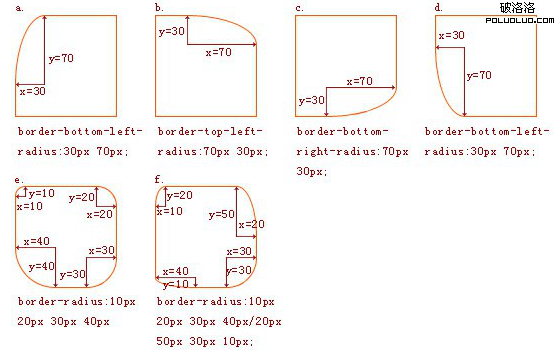 |

**边框大小和外半径、内半径的关系**

实际的内半径相当于外半径减去相应的边框大小。相减的值中如果至少一个为为负值或零，则内半径为直角。
不管怎样，相邻的两个边都会形成流畅的线条。

| 示意图                                    |
| ----------------------------------------- |
| 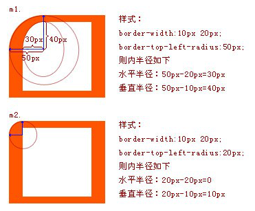 |


| 可以做的形状                              |
| ----------------------------------------- |
| 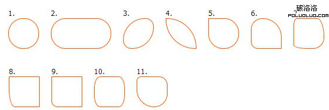 |


椭圆的圆角

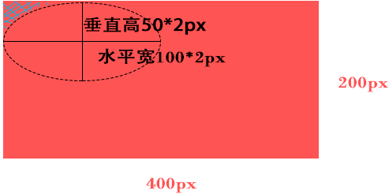 


| 组合示例图                                |
| ----------------------------------------- |
| 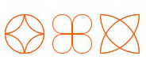 |


## 1、使用border-radius构造有趣图形边框

#### 正方形的内容

代码：

```html
<div id = "test"></div>
<style type="text/css">
	#test{
		width: 100px;
		height:100px;
		background-color:#ffff00;
		border:1px solid #000;
		border-radius:20px;
	}
```


| 效果图                                    |
| ----------------------------------------- |
| 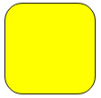 |

#### 圆形边框

设置border-radius大于等于0.5倍的正方形的宽高

代码：

```html
<div id = "test"></div>
<style type="text/css">
#test{
    width: 100px;
    height:100px;
    background-color:#ffff00;
    border:1px solid #000;
    border-radius:50px;
}
</style>
```


| 效果图                                    |
| ----------------------------------------- |
| 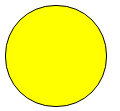 |

#### 边角不相等

代码：

```html
<div id = "test"></div>
<style type="text/css">
#test{
    width: 100px;
    height:100px;
    background-color:#ffff00;
    border:1px solid #000;
    border-radius:40px 20px;//表示左上和右下使用同一个值（前一个），右上角和左下角使用第二个值。
}
</style>
```


| 效果图                                    |
| ----------------------------------------- |
| 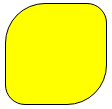 |

#### 四个边角都不一样的时候和四个边角的不同方向的也不一样的时候。

代码：

```html
<div id = "test"></div>
<style type="text/css">
#test{
    width: 100px;
    height:100px;
    background-color:#ffff00;
    border:1px solid #000;
    border-radius:40px 30px 20px 10px;/*水平与垂直的大小相等，依次是左上，右上，右下，左下*/
}
</style>
```


| 效果图                                    |
| ----------------------------------------- |
| 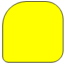 |

#### 四个角都不一样的不规则

代码：

```html
<div id = "test"></div>
<style type="text/css">
#test{
    width: 100px;
    height:100px;
    background-color:#ffff00;
    border:1px solid #000;
    /*第一组表示水平半径，第二组表示垂直半径*/
    border-radius:40px 30px 50px 10px / 15px 25px 35px 45px;
}
</style>
```


| 效果图                                    |
| ----------------------------------------- |
| 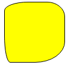 |

#### 设置单个角的弧度

```css
border-top-left-radius: 50px;
```


| 示例图                                    |
| ----------------------------------------- |
| 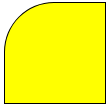 |

#### 半圆 

```html
<div id="circle"></div>
<style type="text/css">
    #circle{
    width: 200px;
    height: 100px;
    background: #ffff00;
    border-radius: 100px 100px 0 0;
}
</style>
```


| 效果图                                    |
| ----------------------------------------- |
| 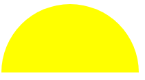 |

#### 圆环

代码：

```html
<div>
   <p></p>
</div>
<style>
    body{
	  background:#000;
	}
	div {
      width: 100px;
      height: 100px;
	}

    p {
      width: 100%;
      height: 100%;
      border: solid 3px lightgreen;
      border-radius: 50%;
    }
</style>
```


| 效果图                                    |
| ----------------------------------------- |
| 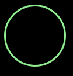 |

#### 实现一个小房子

代码：

```html
<div>
   <p></p>
</div>
<style>
	body{
	  background:#000;
	}
	div {
      width: 100px;
      height: 100px;
	}

    p {
	  width: 100%;
	  height: 100%;
	  border: solid 6px lightgreen;
	  box-sizing: border-box;
	  border-top-left-radius: 50%;
	  border-top-right-radius: 50%;
	}
</style>
```


| 效果图                                    |
| ----------------------------------------- |
| 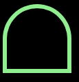 |

#### 隧道

代码：

```html
<div>
   <p></p>
</div>
<style>
	body{
	  background:#000;
	}
	div {
      width: 100px;
      height: 100px;
	}

    p {
	  width: 100%;
	  height: 50%;
	  background: lightgreen;
	  border-top-left-radius: 50%;
	  border-top-right-radius: 50%;
	}
</style>
```


| 效果图                                    |
| ----------------------------------------- |
|  |

#### 扇形

代码：

```html
<div>
   <p></p>
</div>
<style>
	body{
	  background:#000;
	}
	div {
      width: 100px;
      height: 100px;
	}

    p {
	  width: 100%;
	  height: 50%;
	  background: lightgreen;
	  border-top-left-radius: 100%;
	}
</style>
```


| 效果图                                    |
| ----------------------------------------- |
|  |

#### 梯形

代码：

```html
<div>
   <p></p>
</div>
<style>
	body{
	  background:#000;
	}
	div {
      width: 100px;
      height: 100px;
	}

    p {
	  height: 0;
	  width: 100px;
	  border-bottom: 50px solid lightgreen;
	  border-left: 25px solid transparent;
	  border-right: 25px solid transparent; 
	}
</style>
```


| 效果图                                    |
| ----------------------------------------- |
|  |

#### 对角圆角

代码：

```html
<div>
   <p></p>
</div>
<style>
	body{
	  background:#000;
	}
	div {
      width: 100px;
      height: 100px;
	}

	p {
	  width: 100%;
	  height: 50%;
	  background: lightgreen;
	  border-radius: 100% 50%/ 0 100%;
	}
</style>
```


| 效果图                                    |
| ----------------------------------------- |
|  |


#### 一片叶子

代码：

```html
<div>
   <p></p>
</div>
<style>
	body{
	  background:#000;
	}
	div {
      width: 100px;
      height: 100px;
	}

    p {
	  width: 100%;
	  height: 50%;
	  background: lightgreen;
	  border-radius: 0 100% / 0 100%;
	}
</style>
```


| 效果图                                    |
| ----------------------------------------- |
|  |

#### 按钮组

代码：

```html
<style type="text/css">
	div,span{
		margin:0;
		padding:0;
	}
	.btns{
		width:150px;
		height:50px;
		border:1px solid #000;
		/* 固定值写法：border-radius:25px; */
		border-radius:17%/50%;/* 百分比 */
		overflow:hidden;
	}
	.btns span{
		display:block;
		float:left;
		width:50px;
		height:50px;
		line-height:50px;
		box-sizing:border-box;
		text-align:center;
		border:1px solid #000;
	}
</style>
<div class="btns">
	<span>低</span>
	<span>中</span>
	<span>高</span>
</div>
```


| 效果图                                    |
| ----------------------------------------- |
| 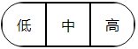 |

百分比写法总结

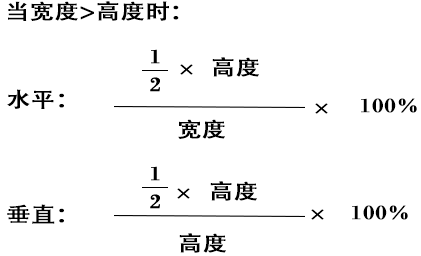 

宽度小于高度时，交换两个值即可，除不尽时可以四舍五入，有点小误差，但基本可忽略。可以尝试不同的系数，实现多种效果

## 2、结合起来使用的效果

效果1

代码：

```html
<div id = "test"></div>
<style type="text/css">
#test{
    width:0;
    height:0;
    border:100px solid gray;
    border-radius:100px;
    border-right-color:#fff;
}
</style>
```


| 效果图                                    |
| ----------------------------------------- |
| 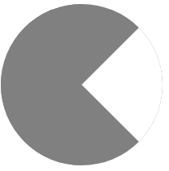 |

效果2

代码

```css
#test{
    height:100px;
    width:200px;
    background: red;
    border-radius:100px/50px;
}
```


| 效果图                                    |
| ----------------------------------------- |
| 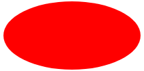 |

效果3

代码

```html
<div id = "test"></div>
<style type="text/css">
#test{
    height:100px;
    width:100px;
    border-radius:90px;/*此时，这个半径应该以边框的外边来计算，所以此时的宽高应该是180px*/
    border-top: 40px solid #ff00ff;
    border-right: 40px solid #ff0000;
    border-left: 40px solid #00ff00;
    border-bottom: 40px solid #00ffff;
}
</style>
```


| 效果图                                    |
| ----------------------------------------- |
| 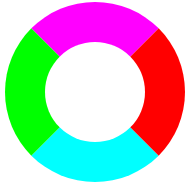 |

效果4，放大镜图标

代码：

```html
<div id="circle"></div>
<style type="text/css">
    #circle{
        width: 50px;
        height: 50px;
        border-radius: 50%;
        border: 5px solid #333;
        position: relative;
    }
    #circle::after {
        content: '';
        display: block;
        width: 8px;
        height: 60px;
        border-radius: 5px;
        background: #333;
        position: absolute;
        right: -22px;
        top: 38px;
        transform: rotate(-45deg);
    }
</style>
```


| 效果图                                    |
| ----------------------------------------- |
|  |

## 总结

1.设置border-radius的方法：

```
/* 单独设置一个角 */
border-top-left-radius: 20px;
border-top-right-radius: 20px;
border-bottom-left-radius: 20px;
border-bottom-right-radius: 20px;

/* 缩写设置 */
border-radius: 20px;/* 所有角设置相同值 */
border-radius: 20px 10px 10px 20px; /* 顺时针顺序 */

/* 百分比设置 */
border-radius: 50%;

/* 椭圆圆弧设置 */
border-radius: 25%/50%; /* 前面一个值代表水平方向，后面一个值代表垂直方向 */

border-radius: 25% 0 0 0/50% 0 0 0;/* 注意，用这种方式分开设置角时要先设置所有角的水平半径，再设置所有角的垂直半径 */
123456789101112131415161718
```

2.border-radius: 50% == border-radius: 50%/50% 
前面一个值是相对宽度的百分比，后面一个值是相对高度的百分比

3.border-radius的原理就是拿一个椭圆/圆去切割一个角

4.想实现一个长方形的圆角时，使用上面的百分比公式