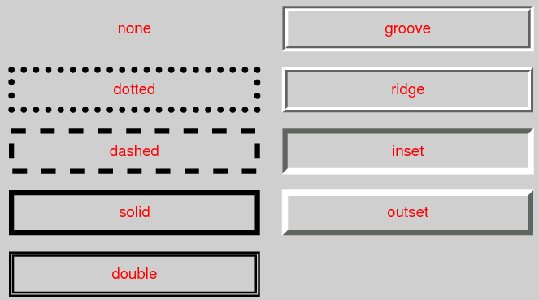
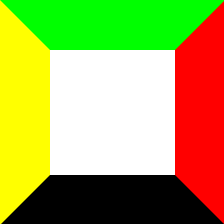
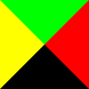
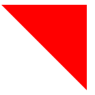
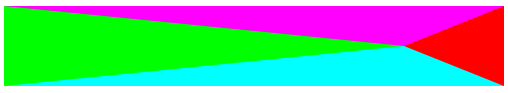

## 边框详解

## **1、border**

border 简写属性在一个声明设置所有的边框属性。

属性1：

```css
border-width:规定边框的宽度;
```

取值：

```shell
thin:定义细的边框。
medium:默认。定义中等的边框。
thick:定义粗的边框。
length:允许您自定义边框的宽度。常用，自己设置宽度大小。
inherit:规定应该从父元素继承边框宽度。
```

属性2：

```css
border-style:规定边框的样式;
```

取值：

```shell
none:定义无边框。
hidden:与 "none" 相同。不过应用于表时除外，对于表，hidden 用于解决边框冲突。
dotted:定义点状边框。在大多数浏览器中呈现为实线。 用过。
dashed:定义虚线。在大多数浏览器中呈现为实线。常用。
solid:定义实线。常用
double:定义双线。双线的宽度等于 border-width 的值。
groove:定义 3D 凹槽边框。其效果取决于 border-color 的值。
ridge:定义 3D 垄状边框。其效果取决于 border-color 的值。
inset:定义 3D inset 边框。其效果取决于 border-color 的值。
outset:定义 3D outset 边框。其效果取决于 border-color 的值。
inherit:规定应该从父元素继承边框样式。
```


| 示意图                                    |
| ----------------------------------------- |
|  |

属性3：

```css
border-color:规定边框的颜色;
```

取值：

```shell
color_name:规定颜色值为颜色名称的边框颜色（比如 red）。
hex_number:规定颜色值为十六进制值的边框颜色（比如 #ff0000）。
rgb_number:规定颜色值为 rgb 代码的边框颜色（比如 rgb(255,0,0)）。
transparent:默认值。边框颜色为透明。有用。
inherit:规定应该从父元素继承边框颜色。
```

## **2、使用纯css实现三角形图标**

原理就是利用四个边线的分界线之间的倒角来生成三角形。

如下样式表

```html
<div id = "test"></div>
<style type="text/css">
    #test{
        width: 100px;
        height: 100px;
        border-top: 40px solid #0f0;
        border-right: 40px solid #ff0000;
        border-left: 40px solid #ffff00;
        border-bottom: 40px solid #000;
    }
</style>
```

为了便于区分，让四个边界的颜色不一样。内容大小也先不为0，符合平常使用的样式。

| 效果图                                    |
| ----------------------------------------- |
|  |

设置内容区域为0;(width:0;height:0)结果如下图

| 效果图                                    |
| ----------------------------------------- |
|  |

如果设置上、右、下的颜色为跟背景相同的颜色||transparent(透明)，或者设置上下与背景相同||transparent(透明)，右边框为none;结果就是一个三角形，别的方向上的三角形也是同理。

```css
#test{
    width: 0px;
    height:0px;
    border-top: 40px solid transparent;
    border-right: 40px solid transparent;
    border-left: 40px solid #ffff00;
    border-bottom: 40px solid transparent;
}
```


| 效果图                                    |
| ----------------------------------------- |
|  |

右上角图像。

```css
#test {
    width: 0;
    height: 0;
    border-top: 100px solid red;
    border-left: 100px solid transparent; 
　　/*只有两个边框的时候，交线为左上到右下*/
}
```


| 效果图                                    |
| ----------------------------------------- |
|  |

或者可以改变四个边线的宽度，或者隐藏，生成自己需要的样式。

```css
#test{
    width: 0px;
    height:0px;
    border-top: 40px solid #ff00ff;
    border-right: 100px solid #ff0000;
    border-left: 400px solid #00ff00;
    border-bottom: 40px solid #00ffff;
}
```


| 效果图                                    |
| ----------------------------------------- |
|  |

小案例：

| 效果图                                    |
| ----------------------------------------- |
|  |

代码：

```html
<style type="text/css">
	.bord{
		width:0;
		height:0;
		border-top:50px solid #6495ED;
		border-right:50px solid #ff0;
		border-bottom:50px solid #7FFFD4;
     }
</style>
<div class="bord"></div>
```

