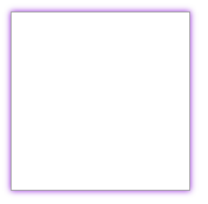

# 阴影

## 边框阴影

**语法**：

```css
E {box-shadow: <length> <length> <length>?<length>?||<color>}
也就是：
E {box-shadow:inset x-offset y-offset blur-radius spread-radius color}
换句说：
对象选择器 {box-shadow:投影方式 X轴偏移量 Y轴偏移量 阴影模糊半径 阴影扩展半径 阴影颜色}
```

<font color="red">box-shadow可以使用一个或多个投影，如果使用多个投影时必须需要用逗号“，”分开。</font>

**取值：**

box-shadow属性至多有6个参数设置，他们分别取值：

**阴影类型：**此参数是一个<font color="red">可选</font>值，如果不设值，其默认的投影方式是外阴影；如果取其唯一值“inset”,就是将外阴影变成内阴影，也就是说设置阴影类型为“inset”时，其投影就是内阴影；

**X-offset:**是指阴影水平偏移量其值可以是正负值可以取正负值，如果值为正值，则阴影在对象的右边，反之其值为负值时，阴影在对象的左边；

**Y-offset:**是指阴影的垂直偏移量，其值也可以是正负值，如果为正值，阴影在对象的底部，反之其值为负值时，阴影在对象的顶部；

**阴影模糊半径：**此参数是可选，但其值只能是为正值，如果其值为0时，表示阴影不具有模糊效果，其值越大阴影的边缘就越模糊；

**阴影扩展半径：**此参数可选，其值可以是正负值，如果值为正，则整个阴影都延展扩大，反之值为负值是，则缩小

**阴影颜色：**此参数可选，如果不设定任何颜色时，浏览器会取默认色，但各浏览器默认色不一样，特别是在webkit内核下的safari和chrome浏览器将无色，也就是透明，建议不要省略此参数。

接下来是一一实现不同的阴影效果：

```html
<!DOCTYPE html>
<html lang="en">
<head>
    <meta charset="UTF-8">
    <title>box-shadow</title>
    <style>
        .demo{
            width:200px;
            height:200px;
            border: 1px solid #999;
            margin: 50px auto;
            box-shadow: 10px 10px 5px #9521de;
        }
    </style>
</head>
<body>
<div class="demo">
</div>
</body>
</html>
```

**box-shadow: 10px 10px 5px #9521de;**（水平和垂直方向是正值的情况） 

| 效果图                                    |
| ----------------------------------------- |
|  |

**box-shadow: -10px -10px 5px #9521de;**（水平和垂直方向是负值的情况）

 

| 效果图                                    |
| ----------------------------------------- |
|  |

**box-shadow: 0px 0px 10px #9521de;**（水平和垂直方向是0的情况，这时四周都会有阴影，这种情况也是经常用到的） 

| 效果图                                    |
| ----------------------------------------- |
|  |

**box-shadow: 0px 0px 10px 10px #9521de;**（水平和垂直方向是0的情况，这时四周都会有阴影， 第三个值是模糊距离（阴影的覆盖面积） 第四个值是阴影的尺寸（这个用的很少）） 

| 效果图                                    |
| ----------------------------------------- |
|  |

**box-shadow: 0px 0px 10px #9521de inset;**水平和垂直方向是0的情况，这时四周都会有阴影， 第三个值是模糊距离（阴影的覆盖面积）设置为内部阴影 ） 

| 效果图                                    |
| ----------------------------------------- |
|  |

**box-shadow: 5px 5px 10px #9521de inset;**水平和垂直方向是正值的情况， 在左上方，第三个值是模糊距离（阴影的覆盖面积）设置为内部阴影 正好和外部阴影相反） 

| 效果图                                    |
| ----------------------------------------- |
|  |

**box-shadow: -5px -5px 10px #9521de inset;**水平和垂直方向是负值的情况，在右下方 ，第三个值是模糊距离（阴影的覆盖面积）设置为内部阴影 正好和外部阴影相反） 

| 效果图                                    |
| ----------------------------------------- |
|  |

以上只是简单实验了一下阴影的效果和位置。其实就在项目中用到的效果来看还是**box-shadow: 0px 0px 10px #9521de;**和 **box-shadow: 10px 10px 5px #9521de;**其实主要是通过熟悉各种效果来自由组合，熟悉各个值代表的含义。 
spread属性用的很少，这个是用于扩展阴影半径的。 
例如：**box-shadow: -5px -5px 10px 10px #9521de inset;** 

| 效果图                                    |
| ----------------------------------------- |
|  |

也可以给每条边单独设置阴影效果： 
box-shadow:5px 5px 5px #000,5px -5px 5px #000,-5px 5px 5px #000,-5px -5px 5px #000; 

| 效果图                                    |
| ----------------------------------------- |
|  |

**分层多个阴影**

该`box-shadow`属性允许元素具有多个阴影，由逗号分隔列表指定。如果指定了多个阴影，阴影将从前到后分层，如下例所示。

 示例显示了按以下顺序指定的五个阴影; 首先是一个黑色阴影，其展开距离为px，模糊距离为px，其次是石灰阴影向右上方偏移，第三个是红色阴影向右下方偏移，应用了模糊距离，第四个黄色阴影偏向底部向左，最后一个蓝色阴影偏移到左上角并应用了模糊距离：

```html
<style type="text/css">
	#test { 
		width:200px;
		height:200px;
		margin:100px;
		box-shadow:
			0 0 10px 5px #000,
			40px -30px gray,
			40px 30px 50px red,
			-40px 30px yellow,
			-40px -30px 50px blue; 
	}
</style>
<div id="test"></div>
```


| 效果图                                    |
| ----------------------------------------- |
|  |

