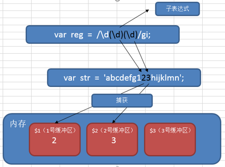
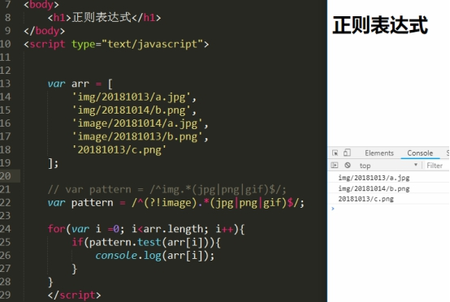

# ES6

## 常量

ES6标准中引入了新的关键字const来定义常量

- 常量必须给初始值
- 常量不能在同一作用域内重新定义或赋值

## 块级作用域

JS作用域：全局作用域、函数作用域、块级作用域（es6新增）

**块级作用域**：由 { } 包括（if语句和for语句{ }，不包括函数)

> 块级作用域，使用var声明变量为全局作用域

**let关键字**：声明的变量只在当前代码块中生效（块级作用域）

- 可以重新赋值
- 不能在同一作用域重复声明
- 无变量提升

**应用**：let块级变量解决i丢失的问题

## 字符串模板（模板字面量）

JS单双引号字符串，均不解析变量，需要使用+号将变量拼接在字符串中

**字符串模板**：允许使用反引号**``**来创建字符串，**${变量}**形式的变量占位符，其中变量可被解析

## 函数

### 参数默认值

ES5定义函数不能指定默认值，ES6定义函数可以指定默认值。

### 展开运算符

**展开运算符**：`...`，将数组和字符串字面量展开为多个元素

```js
//函数本来接收三个单独的参数
function f3(x,y,z){
	console.log(x,y,z);
}

//ES6中，我们可以将一个数组以拓展参数的形式传递，它能很好地映射到每个单独的参数
var arr=[3,4,5];
f3(...arr);//输出：3 4 5 

//ES5中，如果需要传递数组当参数，我们需要使用函数的apply方法
f3.apply(null,arr);//输出：3 4 5 
```

### 不定参数（可变参数/剩余参数）

**不定参数**：在函数中使用命名参数同时接收不定数量的未命名参数

> 与ES5中arguments类似

```js
//不定参数 将多个实参放在一个数组变量中
//  ...x  三个点是固定格式，x是形参变量名
function f1(...x){
	console.log(x);
}
f1(3,4,5); //[3,4,5]

function f2(m, n, ...x){
  	console.log(m, n, x);
}
f2(2,3,4,5,6); // m=2  n=3  x=[4,5,6]
```

## 解构/拆包

**解构**：自动解析数组或对象中的值，并赋值给指定的变量

### 数组解构

```js
var arr = [3,4,5];
var [a, b, c] = arr;

//还可以忽略值 需要使用,占位
var arr = [3,4,5];
var [a,, c] = arr;

//函数返回值为数组，进行解构
function f5(){
	return [1,2,3];
}
var [a, b, c] = f5();
```
### 对象解构

```javascript
var person = {
    "nickname": "老三",
    "age": 30,
    "sex": "男"
};
//解构时 {}中的变量名，不能加引号
var {nickname, age, sex} = person;
console.log(nickname, age, sex);
//可以忽略值  直接忽略 不需要占位
var {nickname, sex} = person;
console.log(nickname, sex);
```

> 变量名和对象成员名一致

### 函数参数解构

#### 函数参数与解构

```js
//1.函数形参，使用解构数组形式，调用函数时需要传递数组实参
function f1([x,y,z]){
  	console.log(x,y,z);
}
var arr = [1,2,3];
f1(arr);

//相当于
/*
function f1(a){
  	var [x,y,z] = a;
  	console.log(x,y,z);
}
var arr = [1,2,3];
f1(arr);
*/

//2.函数形参，使用解构对象形式，调用函数时需要传递对象实参
function f2({nickname,age,sex}){
  	//变量名与对象成员名一致
  	console.log(nickname,age,sex);
}
var obj = {"nickname":"zhangsan", "age":40, "sex":"男"};
f2(obj);

//相当于
/*
function f1(a){
  	var {nickname, age, sex} = a;
  	console.log(nickname,age,sex);
}
var obj = {"nickname":"zhangsan", "age":40, "sex":"男"};
f2(obj);
*/
```

#### 默认值与解构数组

```js
<script>
//1.函数参数使用解构数组，调用函数不传参数会报错
function fn([x, y, z]){
  	console.log(x, y, z);
}
fn(); //会报错
</script>

<script>
//2.函数参数使用解构数组，对整个数组设置默认值为空数组
function f1([x, y, z] = []){
  	console.log(x, y, z);
}
f1(); //不报错  x y z 都是 undefined

//3.函数参数使用解构数组，对整个数组设置默认值,数组中每个变量对应一个默认值
function f2([x, y, z] = [1,2,3]){
  	console.log(x, y, z);
}
f2(); //不报错  x=1 y=2 z=3
f2([4,5,6]); // x=4 y=5 z=6


//4.函数参数使用解构数组，对整个数组设置默认值为空数组, 在解构数组中对每个变量设置一个默认值
function f3([x=1, y=2, z=3]=[]){
  	console.log(x, y, z);
}
f3(); //不报错  x=1 y=2 z=3
f3([4,5,6]); // x=4 y=5 z=6
</script>
```

#### 默认值与解构对象

```js
<script>
//1.函数参数使用解构对象，调用函数不传参数会报错
function fn({x, y, z}){
  	console.log(x, y, z);
}
fn(); //会报错
</script>

<script>
//2.函数参数使用解构对象，对整个对象设置默认值为空对象
function f1({x, y, z} = {}){
  	console.log(x, y, z);
}
f1(); //不报错  x y z 都是 undefined

//3.函数参数使用解构对象，对整个对象设置默认值,对象中每个变量对应一个默认值
function f2({x, y, z} = {"x":1,"y":2,"z":3}){
  	console.log(x, y, z);
}
f2(); //不报错  x=1 y=2 z=3
f2({"x":4,"y":5,"z":6}); // x=4 y=5 z=6


//4.函数参数使用解构对象，对整个对象设置默认值为空对象, 在解构对象中对每个变量设置一个默认值
function f3({x=1, y=2, z=3}={}){
  	console.log(x, y, z);
}
f3(); //不报错  x=1 y=2 z=3
f3({"x":4,"y":5,"z":6}); // x=4 y=5 z=6
</script>
```

## 对象字面量简化

### **ES5对象字面量**

```js
var person = {
    "nickname": "老三",
    "age": 30,
    "sex": "男",
    "say":function(){
          return "hello";
    }
};
```

### 成员属性

属性和变量名称需要一致

```js
var person = {
    nickname,
    age,
    sex
}
```

### 成员方法

省略function关键字

```js
var person = {
    say(){
        
    }
}
```

### 原型对象

对象字面量中定义原型

```js
var person = {
 	say(){
      return "hello";
 	}
};
var coder = {
  	__proto__:person,
  	coding(){
      	return "I'm coding";
  	}
};
console.log( coder.say() );
console.log( coder.coding() );
```

## for of值变量

### **遍历数组**

```js
var team = ["师父", "大师兄", "二师兄", "沙师弟", "小白龙"];
for(var v of team){
  	console.log(v);
}
```

### **遍历字符串**

```js
var str = "zhangsan";
for(var v of str){
  	console.log(v);
}
```

> 不能遍历对象

## symbol数据类型

**ES5数据类型**：`string  number boolean  null  undefined  object`

**ES6新增**：Symbol，表示独一无二的值。定义对象唯一属性名

Symbol类型的值是一个独一无二的值

```js
Symbol()==Symbol() //false
Symbol('zs')==Symbol('zs') //false
```

作为对象属性名的Symbol

```js
var attr_name = Symbol();
var obj = {
	[attr_name]: "Alice" //[]里面attr_name不带引号，表示attr_name为变量
};
console.log(obj[attr_name]);

var obj = {
  	[Symbol()]:"Alice"
};
console.log(obj);
console.log(obj[Symbol()]);//undefined
```

> 不能用点运算符，因为点运算符后面是字符串

## 类和对象

### 类的定义

ES6提供的类为JS原型的包装

class类：包含 构造方法、实例方法、静态方法

- class中不能直接定义属性，只能定义方法，方法之间不需要逗号隔开
- class只能先定义，再使用，没有提升效果
- 静态方法通过类名调用，实例方法只能实例化后再调用

```javascript
//类的定义
class A {
	//ES6中的构造方法（类的属性，定义在构造方法中）
    constructor(name) {
        this.name = name;
        this.age = 30;
    }
    //实例方法
    say() {
        console.log('我是A中的实例方法say，我的名字是 '+this.name);
    }
  	//静态方法(静态方法与实例方法 同名互不影响)
 	static say(){
      	console.log("我是A中的静态方法say");
 	}
}

//直接调用静态方法,由于没有实例化过程，构造方法中的代码不会自动执行
A.say();

//实例化类 调用实例方法
var a = new A('Tom');
a.say();

//类也有原型对象
console.log(A.prototype);
console.log(a.__proto__)
```

### 类的继承

父类有构造函数，子类构造函数中，需要调用super() 实现父类的构造函数

```js
//类的继承
//父类A
class A {
	//ES6中的构造方法
    constructor(name) {
        this.name = name;
        this.age = 30;
    }
    //实例方法
    say() {
        console.log('我是A中的实例方法say，我的名字是 '+this.name);
    }
  	//静态方法
 	static say(){
      	console.log("我是A中的静态方法say");
 	}
}

//子类B
class B extends A {
  	//构造方法
    constructor(name) {
    	//使用函数形式的super(), 直接调用父类构造方法
      	//只要子类写了构造方法(使用了this)，就必须调用super()，且必须在使用this之前
        super(name);
    }
  	//实例方法
  	//子类方法 会覆盖父类同名方法
    say() {
      	//子类方法中，可以使用super.方法() 调用父类的非构造方法
      	//当前方法是实例方法，则调用父类的实例方法
      	//当前方法是静态方法，则调用父类的静态方法
      	//super.say(); 
        console.log('我是B中的实例方法say，我的名字是 '+this.name);
    }
  	
    static coding() {
        console.log('我是B中的静态方法coding');
    }
  	
}
//调用静态方法
B.say(); //A的静态方法
B.coding();//B自己的静态方法

//调用实例方法
var b = new B('Lucy');
b.say();//B中的实例方法say  //如果B中没有，才调用A的实例方法say
b.coding();//报错，B和A中都没有实例方法coding  （只有静态方法）
```

## 箭头函数

`=>`箭头函数

### 语法

#### 一个参数

```js
var f1 = a=>a;
//var f1 = function(a){return a;};
```

#### 没有参数

```js
var f2 = ()=>'test';
```

#### 多个参数

```js
var f3=(a,b)=>a+b;
```

#### 函数体多条语句

```js
var f4= (a,b)=>{
    var c = a+b;
    return c;
}
```

#### 返回对象

```js
var f5 = () => {
    return ({"name":'xiaoA',"age":40});
}
// var f5 = ()=>({"name":'xiaoA',"age":40});
```

#### 事件处理函数

```html
<input type="button" value="点击" id="btn">
<script>
	document.getElementById('btn').onclick = evt=>{
      	console.log(evt);//evt 事件对象
	}
</script>
```

#### 回调函数

```js
var f6 = (f)=>{
    console.log(f(2));
}
var f7 = a=>a;
f6(f7);
```

### 注意

- typeof 判断箭头函数 结果为function
- instanceof 判断是否Function实例 结果为true
- **箭头函数不绑定this，内外this固定不变**

```js
var obj = {
  	say:function(){
      	//非箭头函数
      	var _this = this;
      	var f1 = function(){
      		console.log(_this);//obj
			console.log(this);//window
        };
      	f1();
      	//箭头函数
        var f2 = ()=>{
			console.log(this);//obj
        };
      	f2();
  	}
};
obj.say();
```

- 箭头函数不能做构造函数，不能用new实例，没有prototype
- 不能使用arguments
- 支持默认参数，剩余参数，解构

# 正则表达式

**正则表达式**：对字符串操作的一种逻辑公式，就是用事先定义好的一些特定字符、及这些特定字符的组合，组成一个“规则字符串”，这个“规则字符串”用来对字符串的进行匹配。

**用途**

- 检查一个字符串中是否含有某种子串
- 将匹配的某种子串做替换
- 从某个字符串中取出符合某个条件的子串

**应用**

- 表单验证，验证字符的合法性，如邮箱是否合法，手机号是否合法等等。
- 信息过滤，如论坛帖子或者评论中的非法字符，例如 sql注入、js脚本注入、煽动性的言论
- 信息采集，采集别人网站上面的内容，例如整页采集时 筛选出需求的部分
- 信息替换
- 页面伪静态的规则（url重写）

## 正则语法-元字符

**元字符**：一些具有特殊含义的特殊符号

**普通字符**：所有大写和小写字母、所有数字、所有标点符号和一些其他符号

**正则表达式三步走**

- **匹配符（查什么）（**等价符，字符簇，修饰符，转义符）
- **限定符（查多少）**
- **定位符（从哪查）**

### 限定符

限定符（量词）：指定正则表达式的一个给定组件必须出现多少次才能满足匹配

|     #     |        说明        |          举例           | 等价写法 |
| :-------: | :----------------: | :---------------------: | :------: |
|   *****   |   **0次或多次**    |      zo*<br>z zoo       |   {0,}   |
|   **+**   |   **1次或多次**    |      zo+<br>zo zoo      |   {1,}   |
|   **?**   |    **0次或1次**    | do(es)?<br>do doxy does |  {0,1}   |
|  **{n}**  |      **n次**       |      o{2}<br>food       |          |
| **{n,}**  |    **至少n次**     |     o{2,}<br>fooood     |          |
| **{n,m}** | **最少n次最多m次** |     o{1,3}<br>fooo      |          |

> n,m非负整数 n<=m，逗号和n，m之间不能有空格

**贪婪匹配**：尽可能去多的情况（默认）

**非贪婪匹配**：？加在其他限定符之后，应用匹配div

### 等价符

|   #    |                             说明                             |   等价写法    |
| :----: | :----------------------------------------------------------: | :-----------: |
| **.**  | 匹配**除换行符之外**的任何单个字符<br>匹配**'\n'**，**(.\|\n)** |               |
| **\d** |                         **数字字符**                         |     [0-9]     |
| **\D** |                        **非数字字符**                        |    [^0-9]     |
| **\w** |                    **字母、数字、下划线**                    |  [A-Za-z0-9]  |
| **\W** |                   **非字母、数字、下划线**                   | [^A-Za-z0-9]  |
| **\s** |          **任何空白字符（空格、制表符、换页符等）**          | [\f\n\r\t\v]  |
| **\S** |         **非任何空白字符（空格、制表符、换页符等）**         | [^\f\n\r\t\v] |
| **\n** |                          **换行符**                          |  \x0a 和 \cJ  |
| **\r** |                          **回车符**                          |  \x0d 和 \cM  |
| **\t** |                          **制表符**                          |  \x09 和 \cl  |

### 定位符

|   #    |             说明             |
| :----: | :--------------------------: |
| **^**  |      字符串**开始**位置      |
| **$**  |      字符串**结束**位置      |
| **\b** | 单词边界（单词和空格间位置） |
| **\B** |          非单词边界          |

> 设置RegExp 对象的 Multiline 属性，**$和^** 还会与 **\n 或 \r** 匹配。

### 字符簇

**字符簇**：匹配满足条件的一个字符。`[]`

|     #      |                   说明                   |                    举例                     |
| :--------: | :--------------------------------------: | :-----------------------------------------: |
| **[xyz]**  |      字符集合，**所包含的任意**字符      |             [abc]<br>plain -> a             |
| **[^xyz]** |    负值字符集合，**未包含的任意**字符    |         [^abc]<br>plain -> p,l,i,n          |
| **[a-z]**  |     字符范围，**指定范围内任意字符**     |                                             |
| **[^a-z]** | 负字符范围，**不在指定范围内的任意字符** |                                             |
|  **x\|y**  |               或，匹配x或y               | z\|food<br>z food<br>(z\|f)ood<br>zood food |

[0-9] 查找任何从 0 至 9 的一个数字

[a-z] 查找任何从小写 a 到小写 z 的字符。

[A-Z] 查找任何从大写 A 到大写 Z 的字符。

[A-z] 查找任何从大写 A 到小写 z 的字符。包括**[ \ ]^_`**等六个字符

[A-Za-z]查找任何从大写 A 到小写 z 的字符，不包括[ \ ]^_`等六个字符

### 修饰符

修饰符写在**正则表达式末尾/之后**，可以一次性使用多个修饰符

|   #   |                 说明                 |
| :---: | :----------------------------------: |
| **i** |  大小写**不敏感**（默认区分大小写）  |
| **g** |             **全局**匹配             |
| **m** | **多行**匹配（^$匹配每行开始和结束） |

### 转义字符

|  #   |           说明           |
| :--: | :----------------------: |
|  \   | 将下一个字符标记为转义符 |

> `[]$.*?+|^{}()`需要加转义字符

## js种正则对象

**正则对象两种定义方式**

```js
	var pattern = /[a-z]/;//将正则表达式直接当做对象使用。
	var pattern = new RegExp(/[a-z]/);//实例化RegExp对象
```

**test方法**：检测目标字符串和正则表达式是否匹配。匹配返回true，不匹配返回false

**exec方法**：执行一个正则匹配，只匹配一次。匹配返回数组类型结果，不匹配null

> 即使使用了全局匹配修饰符g，也匹配一次

**lastIndex属性**：上一次匹配结束的位置，即下一次匹配开始的位置

- 没有更多匹配lastIndex重置为0
- test和exec方法默认匹配一次，匹配后lastIndex重置为0
- 使用了全局修饰符g，lastIndex不会重置为0

```js
	var str = 'php1js22';
	//var pattern = /[a-z]/;//匹配小写字母字符串
	var pattern = /[a-z]/g;//全局匹配小写字母字符串
	var res1 = pattern.exec(str);
	console.log(res1);//["p"] 只匹配一次，返回数组
	console.log(pattern.lastIndex);//1  下一次匹配开始的位置
	var res2 = pattern.exec(str);
	console.log(res2);//["h"] //从位置1开始匹配
```

## 实例

### 检测手机号格式

手机号特点：11位，纯数字，1开头， [23位号段，具体咨询各大运营商]

简单版（限制前两位）：1开头，第二位3-9，后面9位数字

```javascript
/^1[3-9]\d{9}$/
```

精确版（限制前三位）：（如果出现新的手机号段，则不适用，需更新）

示例：

13[0-9]开头、14[579]开头、15[0-3,5-9]开头、166开头、17[0135678]开头、18[0-9]开头、19[89]开头

```javascript
/^1(3[0-9]|4[579]|5[0-3,5-9]|6[6]|7[0135678]|8[0-9]|9[89])\d{8}$/ 
```

### 检测邮箱格式

邮箱特点：

2342.3s_-df@sina.com.cn

通用的邮箱的特点：

简单版：必须有@  正则 /@/

 

精确版：

​	必须有@和.

​	@前面是邮箱名，要求至少一个字符，要求是数字、字母、下划线、[还可以用.-]，但是开头必须是数字字母下划线

​	@和点之间：是一个域名，要求至少一个字符，可以是数字字母中横线，要求开头是数字或字母

​	点后面：要求是至少一个字符，必须是字母

​	点xxx，这部分可以出现一次，也可以出现多次

最后一个点后面，字符长度为2-6的字母

```javascript
var pattern = /^\w[\w\.-]*@[0-9a-z][0-9a-z-]*(\.[a-z]+)*\.[a-z]{2,6}$/i;
```

### 结巴问题

匹配重复字符，保留一个

```js
var str = "今今今天晚晚晚晚晚晚上吃吃吃吃吃吃鸡";
//今天晚上吃鸡
var res = str.replace(/([\u4E00-\u9FA5])\1+/g, '$1');
console.log(res);
```
## 分组/捕获和反向引用

**捕获和反向引用的语法的解释**：

**子表达式**
在正则表达式中，通过一对圆括号括起来的内容，我们就称之为“子表达式”。如：
`var reg = /\d(\d)\d/gi;`

**捕获**（分组）
在正则表达式中，子表达式匹配到相应的内容时，系统会自动捕获这个行为，
然后将子表达式匹配到的内容放入系统的缓存区中。我们把这个过程就称之为“捕获”。


**反向引用**
在正则表达式中，我们可以使用\n（n>0，正整数，代表系统中的缓冲区编号）
来获取缓冲区中的内容，我们把这个过程就称之为“反向引用”。


在正则语法中，用“\1”来引用前面的捕获（使用子表达式匹配的结果）。用\2表示第二个捕获的内容….

在正则语法外（如replace时），用“$1”来引用前面的捕获。

```javascript
	var str = '1122 3434 5566 7879 9887';
	//匹配连续四个数字，第一和第二数字相同，第三和第四数字相同
	var res = str.match(/(\d)\1(\d)\2/g);
	console.log(res);
	//匹配连续四个数字，第一和第三数字相同，第二和第四数字相同
	var res = str.match(/(\d)(\d)\1\2/g);
	console.log(res);
	//匹配连续四个数字，第一和第三数字相同
	var res = str.match(/(\d)\d\1\d/g);
	console.log(res);
	//匹配连续四个数字，第一和第二数字相同，第三和第四数字相同，并将相同的数字只保留一个
	var res = str.replace(/(\d)\1(\d)\2/g, '$1$2');
	console.log(res);
```

禁止引用

(?:正则)： 这个小括号中的内容不能够被引用

```javascript
	var str = '1122 3434 5566 7879 9887';
	var res = str.match(/(?:\d)(\d)\1\d/g);
	console.log(res);//9887
```

##  匹配中文

`[\u4E00-\u9FA5]`表示中文

**完整的Unicode编码表**：[http://blog.csdn.net/hherima/article/details/9045861](http://blog.csdn.net/hherima/article/details/9045861)

## 环视

正则表达式中，用于查找某些内容之前或者之后的东西，叫做环视。

环视通常也叫做预查、断言或者零宽断言。

### 正向肯定预查

也叫 顺序肯定环视

every(?=n) 匹配任何其后紧接指定字符串 n 的字符串。

```javascript
	//匹配后面字符为10的win
	var str = "win7 win8 win10";
	var res = str.match(/win(?=10)/g);
	console.log(res); //["win"]
```


### 正向否定预查

也叫 顺序否定环视

every(?!n) 匹配任何其后没有紧接指定字符串 n 的字符串。

```javascript
	//匹配后面字符不为10的win
	var str = "win7 win8 win10";
	var res = str.match(/win(?!10)/g);
	console.log(res); //["win", "win"]
```

(?!B)[A-Z]这种写法，其实它是[A-Z]范围里，排除B的意思，前置的(?!B)只是对后面数据的一个限定，从而达到过滤匹配的效果。

```javascript
	var str = "abcd1234";
	var res = str.match(/(?!c)[a-z]/g);
	console.log(res); //["a", "b", "d"]
```

练习：从一堆图片地址中，找出符合条件的图片地址。

```javascript
	var arr = [
		'img/20181013/a.jpg',
		'img/20181014/b.png',
		'image/20181014/a.jpg',
		'image/20181013/b.png',
		'20181013/c.png'
	];
```

匹配img开头的图片地址

```javascript
/^img.*(jpg|png|gif)$/g
```

匹配不以image开头的图片地址

```javascript
/^(?!image).*(jpg|png|gif)$/
```



## String 对象的正则方法

### match方法

**stringObj.match(regex)**：在字符串中检索匹配正则表达式regex的子串；

匹配，返回包含匹配结果的一个数组；不匹配返回null

- 不带全局修饰符g，则只匹配一次
- 带全局修饰符g，则匹配所有结果

### replace方法

**stringObj.replace(regex, replacement)**：在字符串中检索匹配正则表达式regex的子串，并替换为指定的字符串replacement；

同match

$1：表匹配第一个子表达式：

$2：第二个子表达式，以此类推

### search方法

**stringObj.search(regex)**：在字符串中搜索符合正则表达式的结果。

找到结果返回结果的起始位置，停止向后检索；如果没有匹配结果，返回-1.

**忽略全局标识符g**

### split方法

**stringObj.split(regex)**：把一个字符串分割成字符串数组, 返回一个数组

