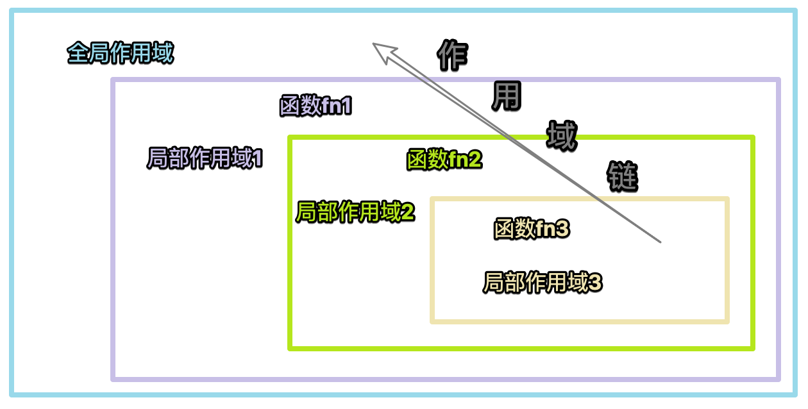
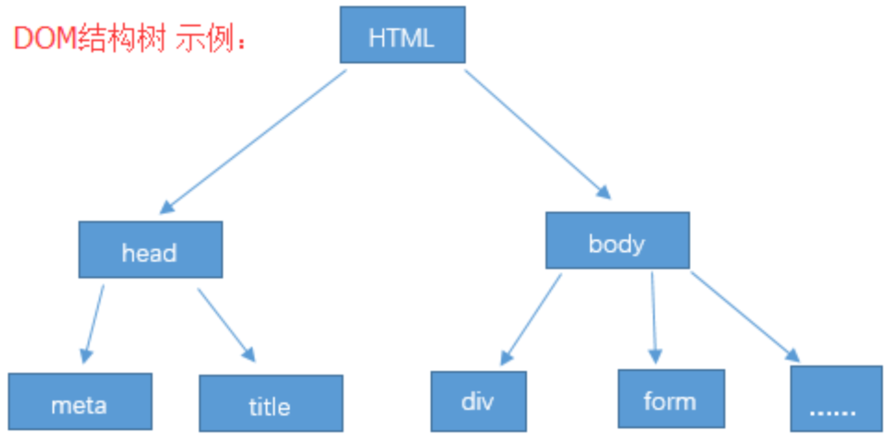
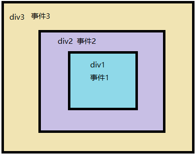
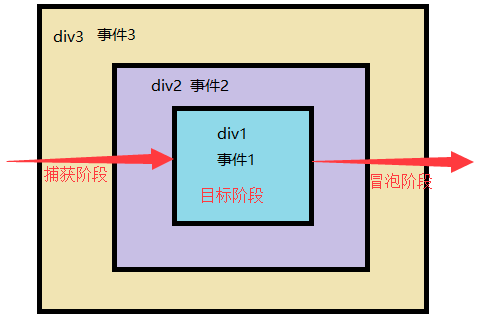

# JavaScript

JavaScript，是一种客户端脚本语言，主要用来向HTML网页添加各式各样的动态功能,为用户提供更流畅美观的浏览效果

可以直接嵌入HTML页面，但写成单独的js文件有利于结构和行为的分离

JS主要运行于客户端（浏览器），也可以运行在服务端（操作系统）

## JavaScript组成

ECMAScript 是一套标准，定义了一种语言的标准，规定了基本语法、数据类型、关键字、具体API的设计规范等，解析引擎设计的参考标准，但与具体实现无关


- **ECMAScript** - JavaScript核心
  - **语法标准**，描述了JavaScript语言的基本语法和数据类型
- **BOM** - 浏览器对象模型
  - **操作浏览器**功能的API，通过BOM可以操作浏览器窗口
- **DOM** - 文档对象模型
  - DOM可以把HTML看做是文档树，通过DOM提供的API可以对树上的节点进行操作

## 三种引入方式

- **行内**

```html
<input type="button" value="按钮" onclick="alert('Hello World')" />
```

- **script标签内**

```html
<script>alert('Hello World!');</script>
```

- 写在外部文件，页面引入

```html
html
<script src="main.js"></script>
main.js
alert('Hello World!');
```

> 引用外部js文件script 标签中不可以再写JavaScript，写了也会覆盖

## 变量

变量是计算机内存中存储数据的标识符，根据变量名称可以获取到内存中存储的数据

### 变量使用

- var声明变量 `var age`
- 变量的赋值 ·`var age;age = 18;`
- 声明多个变量 `var age, name;`
- 声明并赋值`var age = 10, name = 'zs';`

### 变量命名规则和规范

- 规则

  - 由字母、数字、下划线、$符号组成，且不能以数字开头
  - 区分大小写
  - 不能是关键字和保留字

  

- 规范
  - 变量名必须有意义
  - 遵守驼峰命名法

### 代码调试

- **alert 弹框**  :浏览器页面弹框
- **console.log()**  浏览器console控制台
- **document.write()** 浏览器页面中

## 数据类型

### 简单数据类型

Number、String、Boolean、Undefined、Null

>获取数据类型 -> typeof age

**Number类型**

**数值字面量**：数值的固定值的表示法

**数值范围**

- 最小值：Number.MIN_VALUE（5e-324）
- 最大值：Number.MAX_VALUE（1.7976931348623157e+308）
- 无穷大：Infinity
- 无穷小：-Infinity

> 不要直接判断浮点数是否相等

**String类型**

'abc'   "abc"  单双引号引起来的一连串字符

- length属性用来获取字符串的长度
- 字符串拼接使用 + 连接

> 两方都是数字，+号算术功能。一方为字符串，+号为字符串拼接

**Boolean类型**

Boolean字面量：  true和false

**Undefined**：声明了没有赋值的变量

**null**：变量为空。（需手动设置）

### 复杂数据类型

**Object对象**：保存很多数据的一种数据类型

> instanceof   判断一个值，是否是某一个构造函数的实例对象

### 数据类型转换

#### 转成字符串

**toString()**：`s.toString()`

**String()**：`String(s)`

> String()函数用于处理没有toString()，eg：undefined和null

**拼接字符串方式**：+两边一个操作符是字符串类型，一个操作符是其它类型，会把其它类型转换成字符串进行计算

#### 转成数值类型

**Number()**：**把任意值转换成数值**，转换的字符串中有一个不是数值的字符，返回NaN

> null -> 0 , undefined -> NaN

**parseInt()**：**字符串转换成数值**，字第一个字符是数字会解析,直到遇到非数字结束；第一个字符不是数字或者符号就返回NaN

**parseFloat()**：**字符串转换成浮点数**，会解析第一个`.` 遇到第二个`.`或者非数字结束

#### 转成布尔类型

**Boolean()**：`0、'(空字符串)' 、null、 undefined 、NaN` 会转换成false，其余为true

## 操作符

**表达式**：值和操作符运算会有一个结果

**算术运算符**：`+ - * / %`

**一元运算符**：只有一个操作数的运算符，会直接修改原始变量数据

- **前置`++/--`**：先+/-1，再运算
- **后置`++/--`**：先运算，再+/-1

**逻辑运算符**

- **`&&`与运算**： 同真为真，其余为假
- **`||`或运算**： 左边为真则取左边，左边为假则边右边
- **`! `非运算**：  取反

**关系运算符**：`<  >  >=  <= == != === !==`

> `==`与`===`的区别：前者比较值，后者比较值和类型

**赋值运算符**：`=   +=   -=   *=   /=   %= `


## 流程控制

**三种基本结构**

**顺序结构**： 从上到下执行的代码

**分支结构**：根据不同的情况及判断，执行对应代码

**循环结构**：重复执行一段代码

### 分支结构

#### **if语句**

```javascript
if(){
   
}else if(){
         
}else{
    
}
```

**三元运算符**：`表达式1 ? 表达式2 : 表达式3`

> if...else简化

#### **switch语句**

```javascript
switch(){
       case 常量1:语句;break;
   	   case 常量2:语句;break;
       default:语句;break;
}
```

>break可以省略，省略后代码会继续执行下一个case
>
>switch 语句在比较值时使用全等操作符

### 循环结构

#### while语句

```javascript
// 当循环条件为true时，执行循环体，
// 当循环条件为false时，结束循环。
while (循环条件) {
  //循环体
}
```

#### do...while语句

```javascript
do {
  // 循环体;
} while (循环条件);
//先执行再判断
```

#### for语句

```javascript
for (初始化表达式1; 判断表达式2; 自增表达式3) {
  // 循环体4
}
```

#### continue和break

**break**:立即跳出整个循环

**continue**:立即跳出当前循环，继续下一次循环（跳到i++的地方）

## 特殊的对象-数组

将多个元素（通常是同一类型）按一定顺序排列放到一个集合中，那么这个集合我们就称之为数组。

### 数组的创建

```javascript
// 字面量方式创建数组
var arr1 = []; //空数组
// 创建一个包含3个数值的数组，多个数组项以逗号隔开
var arr2 = [1, 3, 4]; 
// 创建一个包含2个字符串的数组
var arr3 = ['a', 'c']; 
//数组的length属性获取数组的长度
arr3.length
var arr1 = [a,b,c]; // 一维数组
var arr2 = [a,b,c,[d,e]]; // 二维数组
var arr3 = [a,b,c,[d,e,[f,g]]]; // 三维数组
var arr4 = [a,b,c,[d,e,[f,g,[h,t,y]]]]; // 四维数组
```

> 数组的维度越大，复杂度越高

### 获取数组元素

`数组名[下标]`

- 下标从0开始
- 下标不存在，返回undefined

### 遍历数组

对数组的每一个元素都访问一次就叫遍历。

#### for循环

```javascript
for(var i = 0; i < arr.length; i++) {// 数组遍历的固定结构}
```

#### while循环

```javascript
while(i<arr1.length){
    console.log(arr1[i]);
    i++;
}
```

### 修改/添加元素

`数组名[下标/索引] = 值`

- 下标对应有值，覆盖
- 下表对应无值，添加

## 函数

一段相对独立的具有特定功能的代码块封装起来，形成一个独立实体。

### 函数声明及调用

**关键字声明**

```javascript
function 函数名(){
    //函数体
}
```

**表达式声明**

```javascript
var fn = function(){
    //函数体
}
```

> 声明不会执行，调用才会执行

**调用**：`函数名()`

>可以调用多次

### 参数

```javascript
// 函数内部是一个封闭环境，通过参数，把外部的值传递给函数内部
// 声明
function 函数名(形参1, 形参2, 形参...){
  // 函数体
}
//调用
函数名(实参1, 实参2, 实参3);
```

**形参**：没有具体的值，起占位作用

**实参**：对形参传入对应的参数，传入的参数叫实参

> 实参的个数可以比形参多

### 函数返回值

函数通过return返回一个值

```javascript
function 函数名(形参1, 形参2, 形参...){
  //函数体
  return 返回值;
}
//通过变量接收返回值
var 变量 = 函数名(实参1, 实参2, 实参3);
```

> return 默认返回值undefined

### 匿名函数与自调用函数

**匿名函数**：没有名字的函数

将匿名函数赋值给一个变量，通过变量可调用函数

```javascript
var fun = function(){
    alert(1);
}
fun();
```

没有变量表示匿名函数则不能直接调用，通过**自调用方式**

```javascript
(function(){
    alert(1);
})()
```

匿名函数自调用：**防止全局变量污染**

### 函数本身也是值

#### 函数作为参数

把函数作为另一个函数的数，在另一个函数中调用

```js
function f1(f){
    f();
}
function f2(){
    console.log(2);
}
f1(f2); //2
```

#### 函数作为返回值

把函数可以作为返回值从函数内部返回。

```javascript
function fn(b) {
  var a = 10;
  return function () {
    alert(a+b);
  }
}
var f = fn(5);
f();  //15
```

## 作用域与JS代码运行

**作用域**：变量可以起作用的范围和区域

### 全局变量和局部变量

**全局变量**：任何地方都可以访问到的变量（关闭网页或浏览器销毁）

**全局作用域**：全局变量所在的区域

**局部变量**：只在固定的代码片段内可访问到的变量（eg：函数内部）(退出作用域之后销毁)

**局部作用域**：局部变量所在的区域

> 不使用var声明的变量是全局变量(不推荐)

### 变量提升

**变量提升**：定义变量，变量的声明会被提升到作用域的最上面，变量的赋值不会提升

```javascript
console.log(a); //undefined
var a = 2;
```

```javascript
console.log(a);//a is not defined
```


**函数提升**：JavaScript解析器会把当前作用域的函数声明提前到整个作用域的最前面

```javascript
var f = 1;
function f(){
    console.log(12); //12
}
// 由于函数提升在前，所以被变量声明替换了；
// 执行阶段，变量被复制为1，不再是一个函数，
f(); // f is not a function
```

### JS代码运行

JavaScript代码执行是由浏览器中的JavaScript解析器来执行的。

JavaScript解析器执行JavaScript代码的时候，分为两个过程：**预解析(编译)过程和代码执行过程**

**预解析过程**

1. 语法检查，有错误，直接停止后续步。
2. 把变量和函数的声明提升到当前作用域的最前面，只会**提升声明**，不会提升赋值和调用。
3. 先提升变量后提升函数，如果函数和变量同名，则被替换；

**代码执行过程**

变量的赋值，函数的调用，循环判断等，根据代码由上往下顺序执行

> 变量和函数同名，函数提升优先

### 词法作用域

变量的作用域是在定义时决定而不是执行时决定的，通过静态分析就能确定，取决于**编译阶段**

词法作用域也叫做**静态作用域**

**js词法作用域**

- 函数可以访问函数外数据
- 代码结构中只有函数可以限定作用域
- 作用域规则首先使用提升规则分析
- 当前作用规则中有名字了, 就不考虑外面的名字

### 作用域链

只有函数可以制造作用域结构。

只要是代码，就至少有一个作用域, 即全局作用域。

代码中有函数，函数就构成另一个作用域。

函数中还有函数，在这个作用域中就又可以诞生一个作用域。

将所有的作用域列出来，可以有一个结构: **函数内指向函数外的链式结构**。



> 变量只在自己的作用域中起作用，但是自己作用域是可以访问上级作用域

## 对象（Object）

JavaScript的对象是无序属性的集合

**对象行为和特征**

- 特征：**属性**
- 行为：**方法**

**属性和方法统称对象的成员**

### 对象的创建

**字面量方式创建对象**

```js
var obj1 = {};//一个空对象
var obj2 = {name:'test',age:20};//两个属性的对象
//一个属性和一个方法的对象
var obj3 = {
    name:'test',
    fei:function(){
        console.log('');
    }
}
```

**new Object() 创建对象 （内置构造函数）**

```js
var person = new Object();

person.name = 'test';
person.age = 20;
person.fun = function(){
    console.log('');
}
```

**自定义构造函数创建对象**

```js
function Person(name,age,job){
      this.name = name;
      this.age = age;
      this.job = job;
      this.fun = function(){
        console.log('');
      }
}
var p1 = new Person('test', 20, 'doctor');
```

**new关键字和构造函数**

**构造函数** ：用来在创建对象时初始化对象， 即为对象成员变量赋初始值，与new运算符一起使用。

- 构造函数用于创建对象，首字母通常大写
- new 关键字也读做实例化

### this指向

**函数如果在某个对象下，this就指向这个对象**

**函数如果被直接调用，this指向window对象**

### 对象的使用

**方法**：`对象.方法名()`

**属性**：`对象.属性`

**遍历对象**：for..in遍历对象（数组也适用）

```javascript
for(var key in obj){
    console.log(key,obj[key]);
}
```

**删除对象的属性**：`delete 对象名.属性`

## 标准库对象

[火狐开发者社区--MDN](https://developer.mozilla.org/zh-CN/)

[微软开发者社区--MSDN](https://msdn.microsoft.com/zh-cn/library/d1et7k7c)

**Math对象**：https://developer.mozilla.org/zh-CN/docs/Web/JavaScript/Reference/Global_Objects/Math

**Date对象**：https://developer.mozilla.org/zh-CN/docs/Web/JavaScript/Reference/Global_Objects/Date

**Aarry对象**：https://developer.mozilla.org/zh-CN/docs/Web/JavaScript/Reference/Global_Objects/Array

**String对象**：https://developer.mozilla.org/zh-CN/docs/Web/JavaScript/Reference/Global_Objects/String

**标准内置对象**：https://developer.mozilla.org/zh-CN/docs/Web/JavaScript/Reference/Global_Objects

>while 与 for 循环后面不要加分号
>
>if else、switch等分支语句后面不要加分号
>
>关键字声明函数，后面不要加分号
>
>表达式声明函数，函数后面加分号

## 浏览器API

**API**（Application Programming Interface,应用程序编程接口）是一些预先定义的函数，目的是提供应用程序与开发人员基于某软件或硬件得以访问一组例程的能力，而又无需访问源码，或理解内部工作机制的细节

**浏览器提供的一套操作浏览器功能和页面元素的API(BOM和DOM)**

浏览器API提供了三种类型：**浏览器操控类(BOM)、页面文档操控类(DOM)、网络控制类**

> 浏览器提供的API并不只有这三类，还有文档对象模型、设备API、通信API、数据管理API、特权API、已认证应用程序的私有API

### 文档对象模型 (DOM) 

DOM是JavaScript操作网页的接口，全称为“文档对象模型”(Document Object Model)。将网页转为一个**JavaScript对象**，从而可以用脚本进行各种操作(增删改查)

浏览器会根据DOM模型，将结构化文档(比如HTML和XML)解析成一系列的节点， 再由这些节点组成一个**树状结构(DOM Tree)**。 所有的节点和最终的树状结构，都有规范的对外接口。 



#### 节点

**DOM的最小组成单位**叫做节点(node)。文档的树形结构(DOM树)，就是由各种不同类型的节点组成。 

**顶层**：docoment节点，文档根节点（window.docoment）

**父节点关系(parentNode)**：直接的那个上级节点 
**子节点关系(childNodes)**：直接的下级节点 
**同级节点关系(sibling)**：拥有同一个父节点的节点

#### 查找节点

|             方法             |                             详情                             |
| :--------------------------: | :----------------------------------------------------------: |
|  **getElementsByTagName()**  | 参数：**标签名**<br/>返回指定HTML标签元素<br>返回值是类似数组的HTMLCollection对象；失败，返回[]。 |
| **getElementsByClassName()** | 参数：**标签的class属性值**<br>返回class符合条件的元素<br/>返回值是类似数组的HTMLCollection对象；失败，返回[]。 |
|   **getElementsByName()**    | 参数：**标签的name属性值**<br/>返回有name属性的HTML元素<br/>返回值是类似数组的HTMLCollection对象；失败，返回[]<br/>**注意**：最好选择**原生具有name属性**的元素； |
|     **getElementById()**     | 参数：**标签的id属性值**<br/>返回匹配指定id属性的元素节点；没有，返回null<br/>**注意**：参数大小写敏感 |
|     **querySelector()**      | 参数：一个**CSS选择器**<br>返回匹配该选择器的元素节点； <br>多个节点满足条件，则返回第一个匹配节点。没有匹配节点，则返回null |
|    **querySelectorAll()**    | 与querySelector用法类似，区别：返回类似数组的HTMLCollection对象，包含所有匹配给定选择器的节点 |

>querySelector()、querySelectorAll()
>
>- 多个参数值，使用`,`隔开
>
>- 支持复杂的CSS选择器
>
>- 不支持伪类和伪元素选择器

### 事件

一种 触发—响应  的机制：**用户的行为  +  浏览器感知（捕获）到用户的行为 + 事件处理程序**

**事件三要素**：

- **事件源**：(被)触发事件的元素
- **事件类型**：事件的触发方式(例如鼠标点击或键盘点击)
- **事件处理程序**：事件触发后要执行的代码(函数形式)

#### 事件绑定

- **行内方式绑定元素**：onclick是html属性，属性值为可执行代码

  ```javascript
      <input type="button" value="按钮" id="btn" onclick="alert(1)">
      <input type="button" value="按钮" id="btn" onclick="f()">
      <script>
          function f(){
          	console.log(this);//this-> window对象
      	}
      </script>
  ```

- **动态绑定 (节点对象属性)**：获取节点对象的属性onclick值，值为匿名函数

	```javascript
document.getElementById('btn').onclick=function(){
	    console.log(this);//this -> 选中对象 - document.getElementById('btn')
	};
	```
	
	> 缺点：同一元素同一事件只能定义一次，定义两次，后一次会覆盖前一次

- **事件监听(节点对象方法)**：每个节点对象提供了addEventListener方法，给选中节点添加指定类型的事件及事件处理程序

  ```javascript
  document.getElementById('btn').addEventListener('click',function(){
      console.log(this);//选中对象
  })
  ```

  > 可以针对同一元素同一事件，添加多个监听事件，按序执行

- **移除事件监听**

  ```javascript
  function f(){
      alert(1);
  }
  var btn = document.getElementById('btn');
  btn.addEventListener('click',f);
  btn.removeEventListener('click',f);
  ```

>removeEventListener移除监听函数，必须与对应addEventListener方法参数完全一致

#### 事件类型

**事件类型**：https://developer.mozilla.org/zh-CN/docs/Web/Events

|        事件名称        |                 何时触发                 |
| :--------------------: | :--------------------------------------: |
| **页面事件(资源事件)** |                                          |
|          load          |        资源及其相关资源已完成加载        |
|      **焦点事件**      |                                          |
|         focus          |               元素获得焦点               |
|          blur          |               元素失去焦点               |
|      **鼠标事件**      |                                          |
|       mouseenter       |          指针移到元素内          |
|       mouseover        | 指针移到元素或者它的子元素内 |
|       mousemove        |        指针在元素内移动时持续触发        |
|       mousedown        |         按下任意鼠标按钮         |
|        mouseup         |         释放任意鼠标按键         |
|         click          |      按下并释放任意鼠标按键      |
|        dbclick         |           双击鼠标按钮           |
|      contextmenu       |        右键点击 (右键菜单显示前).        |
|       mouseleave       |       指针移出元素范围外（不冒泡）       |
|        mouseout        |    指针移出元素，或者移到它的子元素上    |
|         select         |  文本被选中（input标签、textarea标签）   |
|          copy          |             元素内容被拷贝时             |
|      **键盘事件**      |                                          |
| keydown  | 按下任意按键                                |
| keypress | 除 Shift, Fn, CapsLock 外任意键被按住. (连续触发) |
| keyup    | 释放任意按键                                |
| **form表单事件** |  |
| reset      | 点击重置按钮 |
| submit     | 点击提交按钮                                   |
|**内容变化事件**||
|change|内容改变且失去焦点时触发 （存储事件）|
|input | 内容改变时触发 （值变化事件） |

#### 事件的传播

当点击div1时，触发 事件1，但是，紧跟着，事件2和事件3也被触发了。这种现象是**事件冒泡**



JS中事件发生后，会在不同DOM节点之间传播

传播分为三个阶段

- **捕获阶段**：从window对象传导到目标节点
- **目标阶段**：目标节点上触发
- **冒泡阶段**：从目标节点传回window对象




传播顺序：

- 捕获阶段：window、document、html、body、div；
- 冒泡阶段：div、body、html、document、window。

> **注意：** 三种事件绑定方式监听冒泡阶段事件（默认）

#### 改变事件触发阶段

```javascript
addEventListener('click',function(){
        alert('目标阶段触发');
},false);//默认
addEventListener('click',function(){
        alert('捕获阶段触发');
},true);
```

### 节点操作

#### 增删改

**document.createElement()**

- 生成网页元素节点

- 参数：元素的标签名；

**document.createTextNode()**

- 生成文本节点

- 参数：文本节点的内容

**node.appendChild()**

- 将其作为最后一个子节点，插入当前节点
- 参数：节点对象

**node.hasChildNodes()**
当前节点是否有子节点

**node.removeChild()**
当前节点移除该子节点

- 移除当前节点的子节点

- 参数：子节点

**node.cloneNode()**

- 克隆选中的节点

- 参数：布尔值 

  - true：标签本身及内容

  - false：标签本身

 >注意: 不会克隆绑定到该元素上的事件

**node.innerHTML**

- 有值：设置节点内容
- 无值：获取节点内容

> 不属于W3C DOM规范

**node.innerText** 

返回该元素包含的内容。该属性可读写

#### 节点属性

##### **原生属性**

HTML元素节点的标准属性（即在标准中定义的属性），会自动成为元素节点对象的属性

```
node.id - > 获取id属性
node.class - > 获取类名
```

##### **属性操作**

- **node.getAttribute()**：返回当前元素节点的指定属性。不存在，返回null
- **node.setAttribute()**：为当前元素节点新增属性。属性存在，修改。不存在，添加
- **node.hasAttribute()**：当前元素节点是否包含指定属性
- **node.removeAttribute()**：从当前元素节点移除属性

##### **层级操作**

**node.nextElementSibling**
返回紧跟当前节点后第一个同级节点。没有，返回null；

**node.previousElementSibling**
返回紧跟当前节点前第一个同级节点。没有，返回null；

**node.parentElement**
返回当前节点父级节点；

**node.childNodes**
返回一个NodeList集合，成员包括当前节点所有子节点。

> 注意空格回车也算

**node.firstChild** 

返回节点的第一个子节点，无子节点，返回null

**node.lastChild** 

返回节点的最后一个子节点，无子节点，返回null

##### CSS样式操作

每个DOM对象都有style属性，我们可以直接操作

- 名字需要改写 `background-color -> backgroundColor`
- 属性值都是字符串，设置必须包括单位
- 获取CSS样式，均是行内样式，style中样式无法修改获取，但是可以覆盖

> 不设值为获取，设值为赋值

**getComputedStyle()**：window下方法，接受一个节点对象，返回该节点对象最终样式信息的对象（样式叠加后结果）

##### 其他

**document.documentURI** ：返回文档的 URL。

**node.replaceChild(newChild, oldChild)** ：用指定节点替换当前节点的一个子节点，并返回被替换掉的节点

**nodeType**：https://developer.mozilla.org/zh-CN/docs/Web/API/Node/nodeType

### 事件对象

事件触发，大部分情况下是用户的一种行为，我们并不能确定用户什么时间触发。系统会调用写好的**事件处理程序**

系统会在调用处理程序时，将事件发生时有关事件的一切信息，封装成一个对象

作为参数传给监听函数(事件处理程序)，我们把这个对象称为 **事件对象**

>W3C浏览器：e
>
>IE浏览器：window.event

#### 常用属性

**event.bubbles**:返回布尔值，表示当前事件是否会冒泡
**event.eventPhase**：返回整数值，表示事件流在传播阶段的位置

>0:事件没有发生。
>1:事件处于捕获阶段
>2:事件到达目标节点
>3:事件处于冒泡阶段

**event.type**:返回字符串，表示事件类型，大小写敏感
**event.timeStamp**:返回毫秒时间戳，表示事件发生的时间

**clientX、clientY** :获取鼠标事件触发的坐标

#### 事件代理/委托

**event.target**：对事件起源目标的引用，属性返回**触发事件节点**
**event.currentTarget**：返回**事件当前所在节点**，即正在执行的监听函数所绑定的那个节点

**事件代理/事件委托**：由于事件会在冒泡阶段向上传播到父节点，可以把子节点的监听函数定义在父
节点上，由父节点的监听函数统一处理多个子元素的事件。

#### 阻止浏览器默认行为&阻止事件传播

**event.preventDefault()**：阻止浏览器对当前事件的默认行为

> 监听函数内 return false，也可以阻止默认事件

**event.stopPropagation()**：阻止事件再DOM继续传播，防止触发定义在别的节点上的监听函数

### 浏览器对象模型（BOM）

浏览器对象模型(Browser Object Model)，浏览器对象模型提供了独立于内容的、可以与浏览器窗口进行互动的对象结构。

浏览器对象具体实例化对象：`window对象`

https://developer.mozilla.org/zh-CN/docs/Web/API/Window

#### 对话框

**window.alert()**：一个警告对话框,上面显示有指定的文本内容以及一个"确定"按钮。

**window.prompt()**：一个对话框,对话框中包含一条文字信息,用来提示用户输入文字。返回值：输入内容

**window.confirm()**：方法显示一个具有一个可选消息和两个按钮(确定和取消)的模态对话框 。返回值：true or false

#### 页面加载事件

```javascript
window.onload = function () {
  // 当页面完全加载所有内容（包括图像、脚本文件、CSS 文件等）后执行
}
```

#### 浏览器控制台

**window.console** : 返回console对象的引用，提供了对浏览器调试控制台的访问

**console.clear()** : 清空控制台。

**console.error()**  : 打印一条错误信息

**console.table()** : 将数组或对象数据在控制台以表格形式打印

**console.log()** ： 打印字符串

#### 定时器

##### setTimeout()和clearTimeout()

到达给定的时间之后执行指定的函数，**只执行一次**

```javascript
// 创建一个定时器，1000毫秒后执行，返回定时器的编号
var timerId = window.setTimeout(function () {
  console.log('Hello World');
}, 1000);
// 清除定时器，传入编号
window.clearTimeout(timerId);
//字符串格式的函数的调用
function(str){
    console.log(str);
}
var test = 'hello'
setTimeOut('f(test)',1000);
```

##### setInterval()和clearInterval()

到达给定的时间后**周期调用函数**(单位毫秒)

```javascript
// 创建一个定时器，每隔1秒调用一次
var timerId = window.setInterval(function () {
  var date = new Date();
  console.log(date.toLocaleTimeString());
}, 1000);
window.clearInterval(timerId);
```

#### location对象

https://developer.mozilla.org/zh-CN/docs/Web/API/Location

**window.location** 只读属性，返回一个  **Location**对象，其中包含有关文档当前位置的信息

**URL**：统一资源定位符 (Uniform Resource Locator）

`scheme://host:port/path?query#fragment`

- **scheme**：通信协议，常用的http,ftp,maito等
- **host**：主机，服务器、域名系统、主机名或 IP 地址
- **port**：端口号（可选）。http默认端口为80
- **path**：路径。由零或多个'/'符号隔开的字符串，表示主机的目录或文件地址
- **query**：查询（可选）。给动态网页传递参数，可有多个参数，用`&`符号隔开，参数名和值用`=`符号隔开
- **fragment**：信息片断。字符串，锚点

**页面跳转**：`location.href='#'`

**location.reload()**

- true：刷新页面本身
- false：强制刷新，加载的静态资源文件也会刷新（默认）

#### history对象

https://developer.mozilla.org/zh-CN/docs/Web/API/History

**history.back()** ：浏览器记录中 前往上一页

**history.forward()** ：浏览器记录中前往下一页

**history.go()** : 通过当前页面相对位置从浏览器历史记录加载页面eg：-1：上一页，1：下一页. 

#### navigator对象

https://developer.mozilla.org/zh-CN/docs/Web/API/Navigator

**常用属性**

**userAgent** : 判断用户浏览器的类型

**platform** : 判断浏览器所在的系统平台类型

**geolocation** :  位置定位对象


**webAPI**：https://developer.mozilla.org/zh-CN/docs/Web/Reference/API